# Performance Evaluation of LLM Inference Frameworks

## Benchmarking Report — vLLM on NVIDIA L4 GPU

---

## 1. Experimental Setup

| Parameter         | Value                                      |
| ----------------- | ------------------------------------------ |
| **Inference Engine**  | vLLM v0.16+ (V1 engine)                   |
| **GPU**               | NVIDIA L4 — 24 GB VRAM (Lightning.ai)     |
| **GPU Hourly Cost**   | $1.58 / hr                                |
| **Models**            | DeepSeek-R1-Distill-Qwen-7B (reasoning), Qwen2.5-7B-Instruct (non-reasoning) |
| **Quantizations**     | FP16 (baseline), FP8, BitsAndBytes (INT4) |
| **Load Generator**    | Locust (streaming SSE)                     |
| **Concurrency Levels**| 16 and 64 concurrent users                |
| **Test Duration**     | 90 seconds per sub-test                   |
| **Max Model Length**  | 4096 tokens                               |
| **Tensor Parallelism**| 1                                          |
| **Quality Evaluation**| lm-evaluation-harness (ARC-Challenge 5-shot, MMLU 5-shot, GSM8K 5-shot) |

**Total requests processed: 2,041 — 100% success rate across all experiments.**

Three benchmark campaigns were conducted:

1. **Quantization — Reasoning Model (DeepSeek-R1):** baseline (FP16), FP8, BitsAndBytes at u16 and u64
2. **Quantization — Non-Reasoning Model (Qwen2.5):** baseline (FP16) and FP8 at u16 and u64
3. **I/O Profiles:** 6 prompt categories (all, coding, creative, long_input, reasoning, short_input) at u16 and u64

---

## 2. Quantization Impact — Reasoning Model (DeepSeek-R1)

### 2.1 Latency Improvements with FP8

FP8 quantization delivers substantial latency improvements over the FP16 baseline on the reasoning model:

| Metric     | Baseline (u16) | FP8 (u16) | Improvement |
| ---------- | -------------- | ---------- | ----------- |
| TTFT p50   | 468 ms         | 338 ms     | **−28%**    |
| TPOT p50   | 69 ms/tok      | 45 ms/tok  | **−35%**    |
| E2E p50    | 71,382 ms      | 46,503 ms  | **−35%**    |

At higher concurrency (u64), FP8 still outperforms baseline: TPOT drops from 111 ms to 76 ms (−31%).

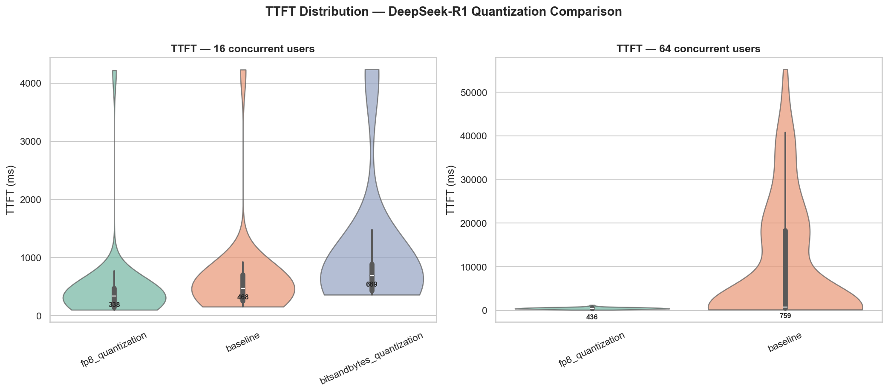

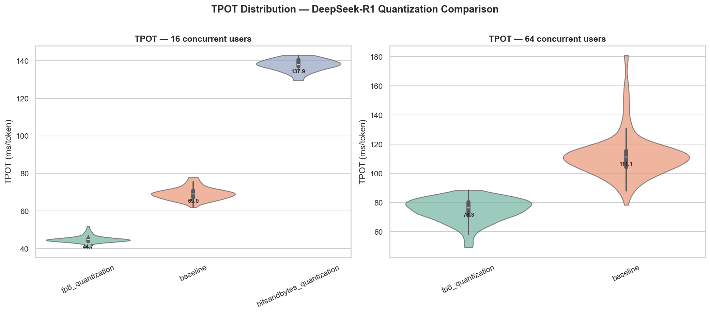

### 2.2 BitsAndBytes (INT4) — Poor Performance

BitsAndBytes quantization shows **severely degraded performance** despite lower memory footprint:

| Metric     | Baseline (u16) | BnB (u16) | Change      |
| ---------- | -------------- | ---------- | ----------- |
| TTFT p50   | 468 ms         | 689 ms     | **+47%**    |
| TPOT p50   | 69 ms/tok      | 138 ms/tok | **+100%**   |
| E2E p50    | 71,382 ms      | 200,770 ms | **+181%**   |

BitsAndBytes nearly **doubles** the token generation time. Only u16 data was available (u64 was not tested).

### 2.3 Latency Heatmaps

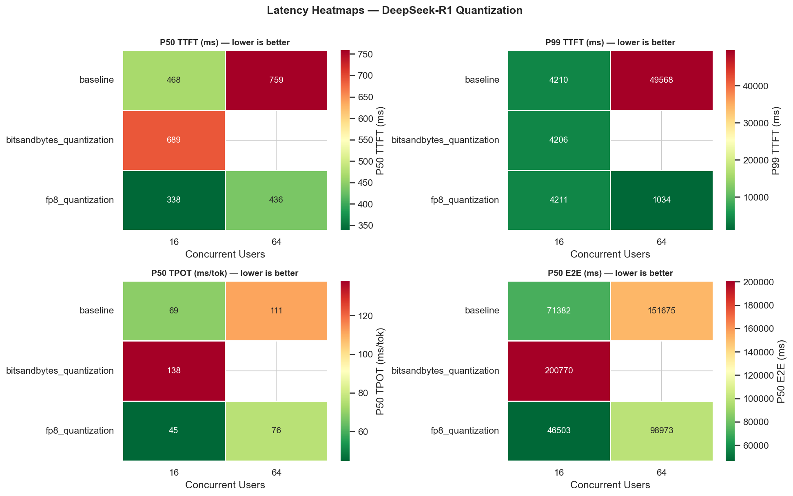

---

## 3. Quantization Impact — Non-Reasoning Model (Qwen2.5)

For Qwen2.5-7B-Instruct, FP8 again improves latency:

| Metric     | Baseline (u16) | FP8 (u16) | Improvement |
| ---------- | -------------- | ---------- | ----------- |
| TTFT p50   | 574 ms         | 403 ms     | **−30%**    |
| TPOT p50   | 72 ms/tok      | 70 ms/tok  | **−3%**     |
| E2E p50    | 41,955 ms      | 39,369 ms  | **−6%**     |

TTFT improvement is significant, while TPOT gain is modest. The non-reasoning model already has lower output token counts, reducing the compounding effect of per-token speedups.

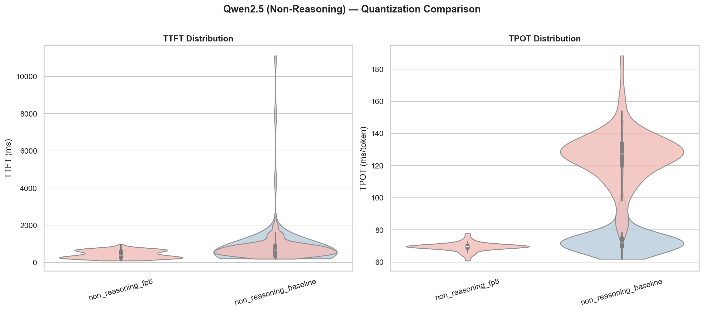

---

## 4. Reasoning vs. Non-Reasoning Comparison

Comparing both models at FP16 baseline:

| Metric     | DeepSeek-R1 (u16) | Qwen2.5 (u16) | Difference |
| ---------- | ------------------ | -------------- | ---------- |
| TTFT p50   | 468 ms             | 574 ms         | +23% (Qwen slower) |
| TPOT p50   | 69 ms/tok          | 72 ms/tok      | Similar    |
| E2E p50    | 71,382 ms          | 41,955 ms      | **−41%** (Qwen faster) |

Despite similar per-token speeds, **Qwen2.5 finishes ~41% faster end-to-end** because it generates far fewer output tokens (non-reasoning does not produce chain-of-thought).

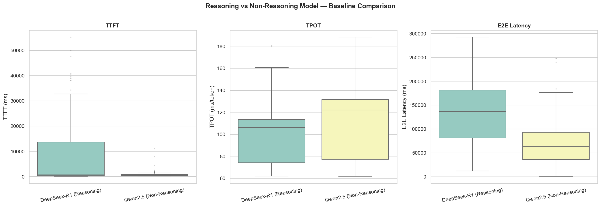

---

## 5. I/O Profile Analysis

Six prompt profiles were tested on DeepSeek-R1 (FP8 quantization) to understand how input/output characteristics affect latency.

### 5.1 TTFT by Profile

TTFT remains **highly consistent** across all profiles (~190 ms at u16, ~260 ms at u64), indicating that input prompt length has minimal impact on time-to-first-token within the 4096-token context window.

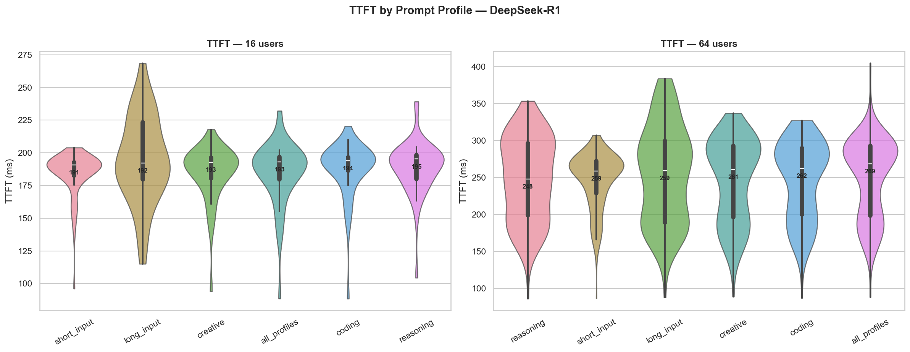

### 5.2 End-to-End Latency by Profile

E2E latency varies significantly with profile type, driven by output token count:

| Profile       | E2E p50 (u16) | E2E p50 (u64) |
| ------------- | ------------- | -------------- |
| short_input   | 36,964 ms     | 52,883 ms      |
| reasoning     | 124,599 ms    | 164,183 ms     |
| coding        | 124,261 ms    | 149,412 ms     |
| creative      | 101,756 ms    | 151,591 ms     |
| long_input    | 126,043 ms    | 169,961 ms     |
| all (mixed)   | 92,864 ms     | 117,772 ms     |

**Short-input prompts** yield the fastest E2E times, while **long-input and reasoning** prompts are the slowest.

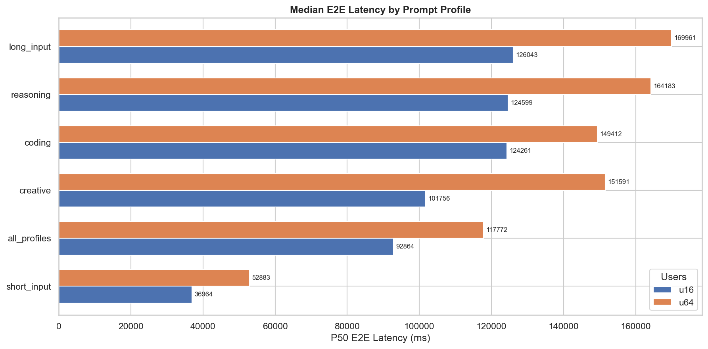

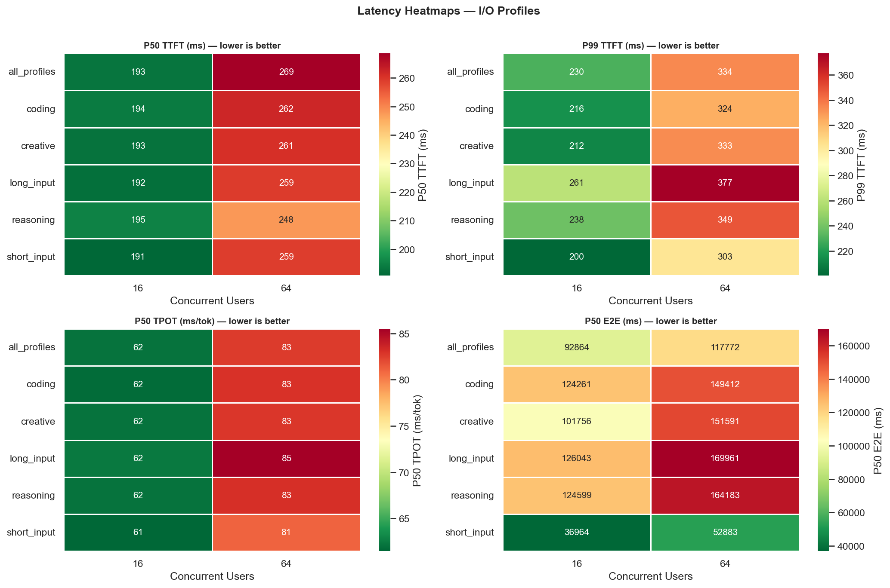

---

## 6. Server-Side Metrics (Prometheus)

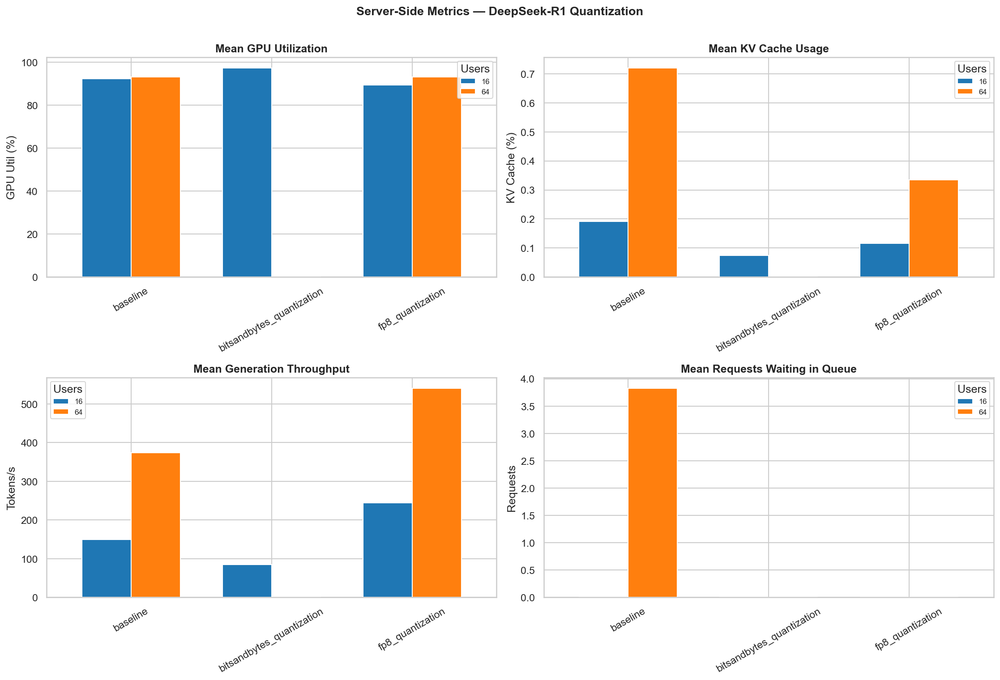

Key observations from vLLM's Prometheus metrics:

- **GPU Utilization:** High across all experiments (typically > 90%), confirming the L4 is fully saturated
- **KV Cache Usage:** BitsAndBytes shows lower KV cache usage due to fewer concurrent requests processed
- **Generation Throughput:** FP8 achieves the highest tokens/sec; BitsAndBytes is notably lower
- **Queue Length:** BitsAndBytes causes a larger request queue, indicating back-pressure under load

---

## 7. Throughput & Cost Analysis

### 7.1 Throughput (tokens/sec)

| Configuration              | u16 (tok/s) | u64 (tok/s) |
| -------------------------- | ----------- | ----------- |
| DeepSeek-R1 Baseline       | 262         | 648         |
| DeepSeek-R1 FP8            | 301         | 937         |
| DeepSeek-R1 BitsAndBytes   | 136         | —           |
| Qwen2.5 Baseline           | 213         | 541         |
| Qwen2.5 FP8                | 230         | —           |

FP8 boosts throughput by **15–45%** depending on concurrency. BitsAndBytes reduces throughput by **48%**.

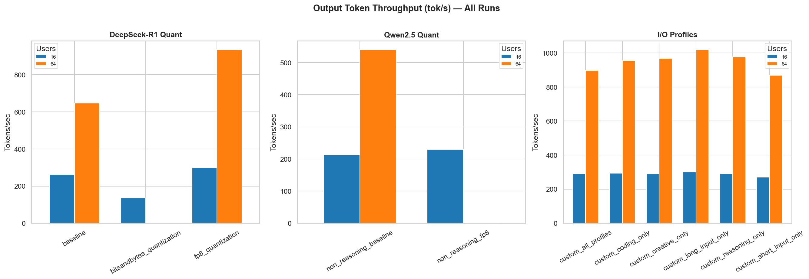

### 7.2 Cost per Million Output Tokens

| Configuration              | u16 ($/M tok) | u64 ($/M tok) |
| -------------------------- | ------------- | ------------- |
| DeepSeek-R1 Baseline       | $1.67         | $0.68         |
| DeepSeek-R1 FP8            | $1.46         | $0.47         |
| DeepSeek-R1 BitsAndBytes   | $3.22         | —             |
| Qwen2.5 Baseline           | $2.06         | $0.81         |
| Qwen2.5 FP8                | $1.91         | —             |

**FP8 at u64 achieves the lowest cost: $0.47/M tokens** — nearly 7× cheaper than BitsAndBytes at u16.

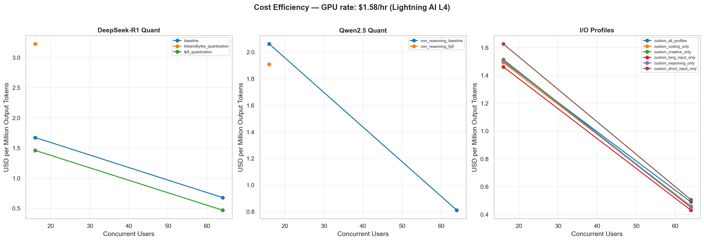

---

## 8. Quality Evaluation (Accuracy)

Quality was evaluated using `lm-evaluation-harness` across three benchmarks.

### 8.1 Absolute Scores

| Model       | Quant          | ARC-Challenge | MMLU  | GSM8K |
| ----------- | -------------- | ------------- | ----- | ----- |
| DeepSeek-R1 | FP16 (baseline)| 0.526         | 0.593 | 0.800 |
| DeepSeek-R1 | FP8            | 0.518         | 0.579 | 0.785 |
| DeepSeek-R1 | BitsAndBytes   | 0.516         | 0.593 | —     |
| Qwen2.5     | FP16 (baseline)| 0.662         | 0.782 | 0.881 |
| Qwen2.5     | FP8            | 0.670         | 0.779 | 0.879 |
| Qwen2.5     | BitsAndBytes   | 0.644         | —     | 0.861 |

**Qwen2.5 outperforms DeepSeek-R1 across all benchmarks** (ARC: 0.662 vs 0.526, MMLU: 0.782 vs 0.593, GSM8K: 0.881 vs 0.800).

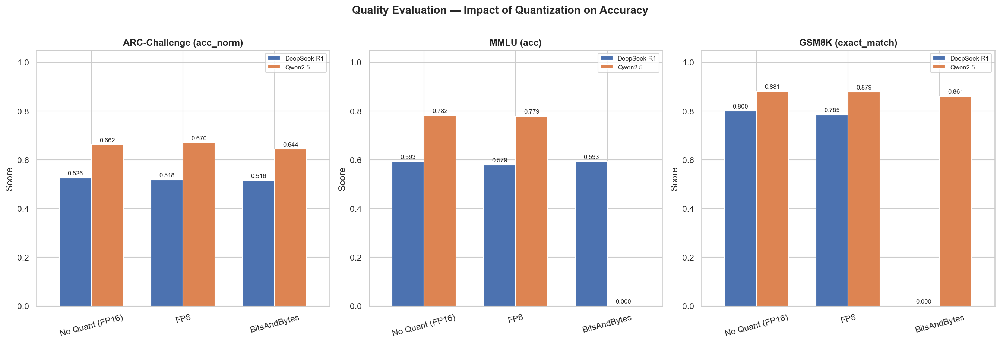

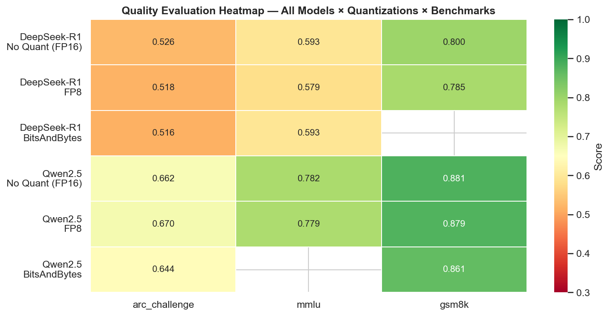

### 8.2 Quantization-Induced Quality Change

| Model / Quant       | ARC     | MMLU    | GSM8K   |
| -------------------- | ------- | ------- | ------- |
| DeepSeek-R1 / FP8    | −1.52%  | −2.37%  | −1.88%  |
| DeepSeek-R1 / BnB    | −1.90%  | 0.00%   | —       |
| Qwen2.5 / FP8        | +1.21%  | −0.45%  | −0.23%  |
| Qwen2.5 / BnB        | −2.72%  | —       | −2.27%  |

- **FP8 causes negligible quality loss** (max −2.37%), well within acceptable bounds
- **BitsAndBytes** shows up to −2.72% degradation, still relatively small
- Qwen2.5 FP8 even **gained +1.21%** on ARC-Challenge (within noise margin)

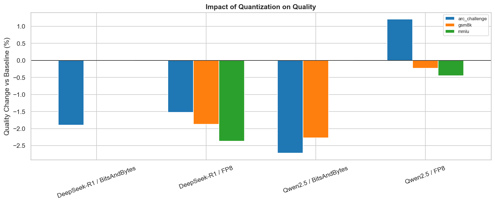

---

## 9. Performance vs. Quality Trade-off

The scatter plots below show the Pareto frontier: where each configuration sits on the latency–accuracy plane.

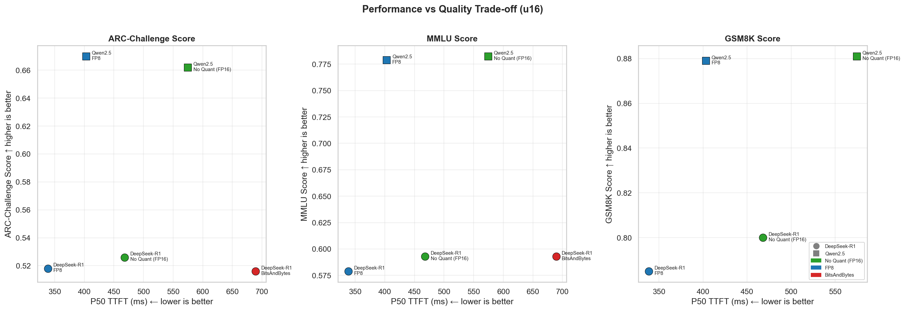

Key takeaway: **FP8 quantization moves configurations toward the ideal corner** (lower latency, same quality), while BitsAndBytes moves toward higher latency with minimal quality benefit.

---

## 10. MMLU Category Breakdown

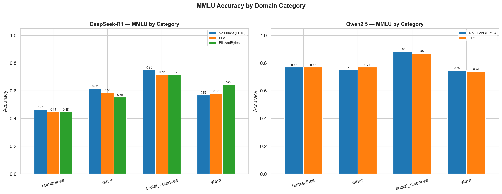

Quantization impact is consistent across all MMLU domains (STEM, Social Sciences, Humanities, Other), confirming that FP8 does not disproportionately degrade any specific knowledge domain.

---

## 11. Key Findings & Recommendations

### Findings

1. **FP8 is the clear winner for quantization.** It reduces TTFT by 28–30%, TPOT by 3–35%, and E2E latency by 6–35%, while causing less than 2.4% quality degradation.

2. **BitsAndBytes (INT4) is not recommended for production.** It doubles TPOT, increases cost by 2–3×, and provides no meaningful quality advantage over FP8.

3. **Reasoning models are significantly more expensive** due to chain-of-thought output. DeepSeek-R1 E2E latency is ~70% higher than Qwen2.5 at the same concurrency.

4. **Higher concurrency (u64) dramatically improves cost efficiency** — up to 3× reduction in cost per million tokens compared to u16. The L4 GPU benefits from request batching.

5. **TTFT is stable across I/O profiles** (~190 ms at u16), suggesting vLLM's prefill phase is efficient and not bottlenecked by input length within the 4096-token window.

6. **E2E latency is primarily driven by output length**, not input length. Short-input prompts finish 3× faster than long-input prompts.

7. **100% success rate** across 2,041 requests confirms vLLM's reliability under load.

### Recommendations

| Goal                    | Recommendation                                  |
| ----------------------- | ----------------------------------------------- |
| Best latency            | FP8 quantization + high concurrency (u64)       |
| Best cost efficiency    | FP8 @ u64 — $0.47/M tokens                     |
| Best quality            | FP16 baseline (marginal gain over FP8)          |
| Best latency/quality    | **FP8** — Pareto-optimal on all benchmarks      |
| Avoid                   | BitsAndBytes — 2× slower, no quality upside     |

---

*Report generated from benchmarking data collected on Lightning.ai infrastructure using vLLM v0.16+ (V1 engine).*
