# vLLM Performance Evaluation — Experiment Report

> **Project:** Performance Evaluations of LLM Inference Frameworks  
> **Model:** DeepSeek-R1-Distill-Qwen-7B (FP16)  
> **GPU:** NVIDIA L4 (24 GB VRAM) — Lightning AI Studio  
> **Framework:** vLLM v0.16+ (V1 Engine)  
> **Date:** March 6, 2026

---

## 1. Goal

Measure how different vLLM serving parameters affect **latency** and **throughput** under realistic user traffic. On a single GPU with a single model, we change one parameter at a time and ask: "what does this setting actually do?"

In short: run vLLM with different configurations, repeat the same load test each time, and compare the results.

---

## 2. Test Environment

| Component | Detail |
|-----------|--------|
| **GPU** | NVIDIA L4 — 24 GB VRAM |
| **Platform** | Lightning AI Studio ($1.58/hr) |
| **Model** | deepseek-ai/DeepSeek-R1-Distill-Qwen-7B |
| **Precision** | FP16 (half precision) |
| **Max Model Length** | 4096 tokens |
| **Max Output Tokens** | 256 tokens (fixed per request) |
| **vLLM Version** | v0.16+ (V1 Engine) |
| **Load Test Tool** | Locust (with streaming SSE) |
| **Test Duration** | 90 seconds per concurrency level |

---

## 3. What We Measured

We collected 4 core metrics for every request:

| Metric | Description |
|--------|-------------|
| **TTFT** (Time to First Token) | Time from sending the request until the first token arrives. The moment the user sees "the response started." |
| **TPOT** (Time Per Output Token) | Time to produce each output token. Shows how fast the text streams. |
| **E2E** (End-to-End Latency) | Total response time from the first request to the last token. |
| **ITL** (Inter-Token Latency) | Time between consecutive tokens. Shows how smooth the token stream is. |

On the GPU side we also tracked:
- **GPU Utilization (%)** — how busy the GPU is
- **VRAM Usage (MB)** — memory consumption
- **KV Cache Utilization (%)** — how full vLLM's KV cache pool is
- **GPU Power (W)** and **Temperature (°C)**
- **Generation Throughput (tok/s)** — server-side token production rate

---

## 4. Experiment Design

### 4.1 Approach

For each experiment:
1. Start vLLM with **specific parameters**
2. Send **increasing concurrent users** via Locust (1 → 4 → 8 → 16 → 32)
3. Run each concurrency level for **90 seconds**
4. Collect GPU metrics **every 2 seconds**
5. Save results to CSV, move to the next experiment

### 4.2 Prompt Dataset

We prepared 37 prompts of varying lengths (short / medium / long categories). Every test randomly samples from the same prompt pool, minimizing prompt-related variance across experiments.

### 4.3 Configurations (Run 1 — Parameter Sweep)

We tested 8 configurations. In each one, **only one parameter** was changed:

| # | Experiment | Changed Parameter | Description | Concurrency |
|---|------------|-------------------|-------------|-------------|
| 1 | **baseline** | — | Plain vLLM: chunked prefill OFF, prefix caching OFF | 1, 4, 8 |
| 2 | **max_seqs_8** | `--max-num-seqs 8` | Low batch size limit (default: 128) | 1, 4, 8 |
| 3 | **max_seqs_32** | `--max-num-seqs 32` | Moderate batch size limit | 1, 8, 32 |
| 4 | **gpu_mem_80** | `--gpu-memory-utilization 0.80` | Less VRAM for KV cache (default: 0.90) | 1, 4, 8 |
| 5 | **gpu_mem_95** | `--gpu-memory-utilization 0.95` | More VRAM for KV cache | 1, 4, 8, 16 |
| 6 | **chunked_prefill** | `--enable-chunked-prefill` | Split prefill into chunks, interleave with decode | 1, 4, 8 |
| 7 | **prefix_caching** | `--enable-prefix-caching` | Cache KV blocks for shared prefixes | 1, 4, 8 |
| 8 | **chunked_prefill + prefix_cache** | Both ON | vLLM v0.16's own default config | 1, 4, 8, 16 |

### 4.4 Run 2 — Dedicated Prefix Caching Test

After Run 1, we wanted to see prefix caching's effect more clearly. So we used a **special prompt set where all requests share the same system prompt**, and ran 3 additional tests:

| # | Experiment | Description | Concurrency |
|---|------------|-------------|-------------|
| 1 | **prefix_baseline** | Prefix caching OFF (control group) | 1, 4, 8 |
| 2 | **prefix_caching_on** | Prefix caching ON | 1, 4, 8 |
| 3 | **prefix_chunked_plus_cache** | Chunked prefill + Prefix caching | 1, 4, 8 |

---

## 5. Overview

- **Total successful requests:** 1,095 (820 from Run 1 + 275 from Run 2)
- **Error rate:** 0% — every single request succeeded
- **Average GPU power draw:** ~70 W
- **Peak GPU temperature:** 80°C
- **All requests hit output_tokens = 256** (max token limit reached)

---

## 6. Results by Parameter

### 6.1 Baseline (No Optimizations)

Baseline is our reference point. All optimizations off: chunked prefill OFF, prefix caching OFF. The remaining parameters that are relevant to our experiments stay at their vLLM defaults:

| Parameter | Default Value |
|-----------|--------------|
| `max-num-seqs` | 128 (max sequences per batch iteration) |
| `gpu-memory-utilization` | 0.90 (90% of VRAM allocated for KV cache) |
| `block-size` | 16 (tokens per KV cache block) |
| `chunked-prefill` | OFF (explicitly disabled; v0.16 default is ON) |
| `prefix-caching` | OFF (explicitly disabled; v0.16 default is ON) |

| Users | P50 TTFT | P50 TPOT | P50 E2E |
|-------|----------|----------|---------|
| 1 | 75 ms | 56 ms/tok | 14,464 ms |
| 4 | 147 ms | 58 ms/tok | 14,802 ms |
| 8 | 178 ms | 58 ms/tok | 14,933 ms |

**Observation:** TTFT increases with more users (queuing effect). But TPOT stays almost flat — this is expected because token generation is bound by GPU memory bandwidth, barely affected by batch size.

Why is E2E ~14.5 seconds? Because: 256 tokens × 56 ms/tok ≈ 14,336 ms + ~75 ms TTFT ≈ 14,411 ms. Almost exactly matches the measured value.

### 6.2 max-num-seqs — Batch Size Limit

This parameter controls how many requests vLLM can process in a single batch.

**max_seqs_8 (batch limit = 8):**

| Users | P50 TTFT | P50 TPOT | P50 E2E |
|-------|----------|----------|---------|
| 1 | 80 ms | 57 ms/tok | 14,497 ms |
| 4 | 157 ms | 58 ms/tok | 14,871 ms |
| 8 | 185 ms | 58 ms/tok | 15,037 ms |

**max_seqs_32 (batch limit = 32):**

| Users | P50 TTFT | P50 TPOT | P50 E2E |
|-------|----------|----------|---------|
| 1 | 83 ms | 57 ms/tok | 14,497 ms |
| 8 | 167 ms | 58 ms/tok | 14,946 ms |
| 32 | 276 ms | 65 ms/tok | 16,813 ms |

**Observation:** With max_seqs_8, results are very close to baseline at low concurrency. max_seqs_32 was the only config we could test at u=32 — at that point we reached **455 tok/s throughput** (the highest), but TTFT also jumped to 276 ms. A classic throughput vs latency tradeoff.

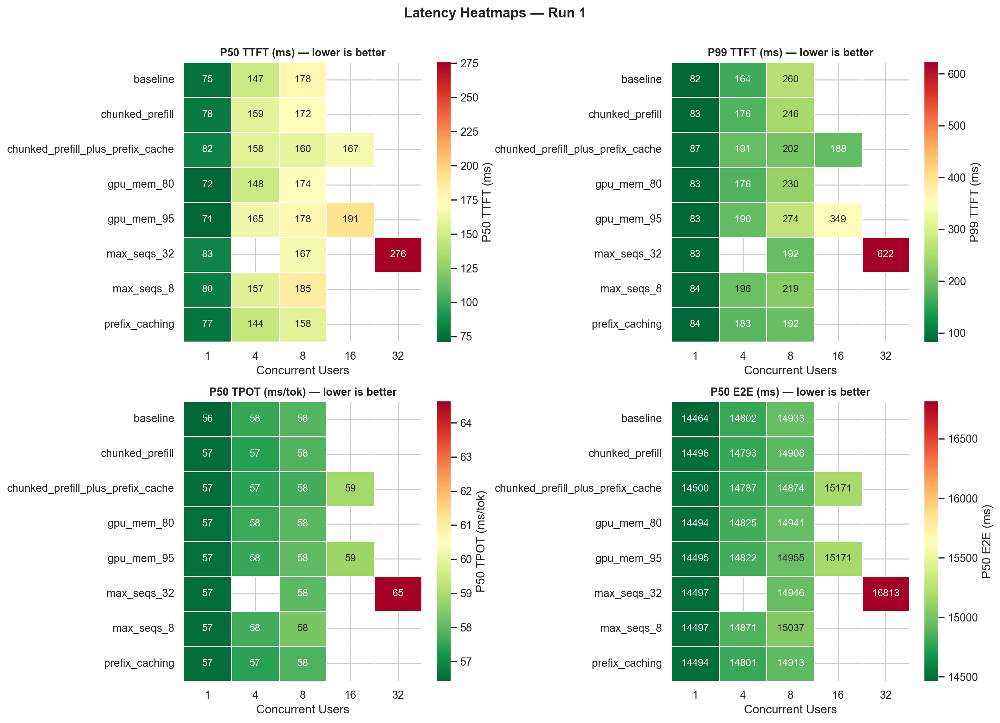

> **Heatmap interpretation:** TPOT (bottom left) stays nearly flat at 56–59 ms/tok across all configs. TTFT (top left) clearly increases with concurrency. The max_seqs_32 u=32 cell is the darkest in both TTFT and E2E — the highest latency.

### 6.3 gpu-memory-utilization — VRAM Allocation Ratio

This parameter controls how much GPU memory vLLM reserves for the KV cache.

**gpu_mem_80 (80% VRAM):**

| Users | P50 TTFT | P50 TPOT | P50 E2E |
|-------|----------|----------|---------|
| 1 | 72 ms | 57 ms/tok | 14,494 ms |
| 4 | 148 ms | 58 ms/tok | 14,825 ms |
| 8 | 174 ms | 58 ms/tok | 14,941 ms |

**gpu_mem_95 (95% VRAM):**

| Users | P50 TTFT | P50 TPOT | P50 E2E |
|-------|----------|----------|---------|
| 1 | 71 ms | 57 ms/tok | 14,495 ms |
| 4 | 165 ms | 58 ms/tok | 14,822 ms |
| 8 | 178 ms | 58 ms/tok | 14,955 ms |
| 16 | 191 ms | 59 ms/tok | 15,171 ms |

**Observation:** There's no significant difference between gpu_mem_80 and gpu_mem_95. The reason: a 7B model fits comfortably on a 24 GB L4 — KV cache usage peaks at only **5.4%** even under maximum load. So changing the VRAM allocation is tuning a resource that's not a bottleneck here. On larger models or longer context windows, this parameter would matter much more.

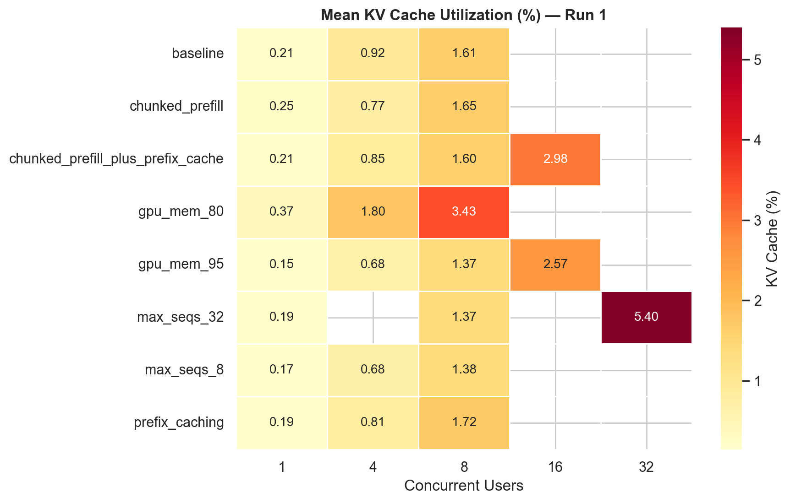

> **KV Cache Heatmap interpretation:** KV cache usage ranges from 0.15% to 5.40% across all configurations. The model is small relative to the GPU's capacity, so KV cache never becomes a bottleneck.

### 6.4 Chunked Prefill

Chunked prefill splits the prefill (initial processing) phase of long prompts into smaller chunks. This way, while one request's prefill is running, other requests' decode (token generation) steps are not blocked.

| Users | P50 TTFT | P50 TPOT | P50 E2E |
|-------|----------|----------|---------|
| 1 | 78 ms | 57 ms/tok | 14,496 ms |
| 4 | 159 ms | 57 ms/tok | 14,793 ms |
| 8 | 172 ms | 58 ms/tok | 14,908 ms |

**Observation:** No noticeable difference from baseline at low concurrency. Chunked prefill's real benefit comes from managing prefill/decode contention under high load. In our test set, prompts are relatively short (max 127 tokens), so there's no significant prefill bottleneck to begin with.

### 6.5 Prefix Caching

Prefix caching reuses KV cache blocks for requests that share a common prefix, instead of recomputing them from scratch.

| Users | P50 TTFT | P50 TPOT | P50 E2E |
|-------|----------|----------|---------|
| 1 | 77 ms | 57 ms/tok | 14,494 ms |
| 4 | 144 ms | 57 ms/tok | 14,801 ms |
| 8 | 158 ms | 58 ms/tok | 14,913 ms |

**Observation:** Even with random prompts in Run 1, prefix caching shows TTFT improvement at u=8 (158 vs 178 ms compared to baseline). But its real power shows up with shared system prompts (Run 2).

### 6.6 Chunked Prefill + Prefix Caching (Combo)

This is vLLM v0.16's default configuration. Both features enabled together.

| Users | P50 TTFT | P50 TPOT | P50 E2E |
|-------|----------|----------|---------|
| 1 | 82 ms | 57 ms/tok | 14,500 ms |
| 4 | 158 ms | 57 ms/tok | 14,787 ms |
| 8 | 160 ms | 58 ms/tok | 14,874 ms |
| 16 | 167 ms | 59 ms/tok | 15,171 ms |

**Observation:** At u=16, this combo achieves **192 ms P99 TTFT** and **253 tok/s throughput** — the best balance. This explains why vLLM developers chose this as the default.

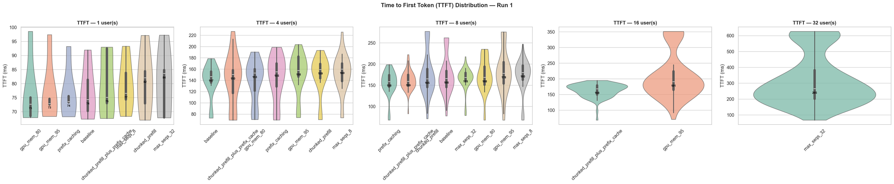

> **Violin plot interpretation:** TTFT distributions for each config at each concurrency level. At u=1 they're all very close (~70–95 ms). Divergence starts at u=8. Only certain configs scale to u=16 and u=32.

---

## 7. Throughput and Cost

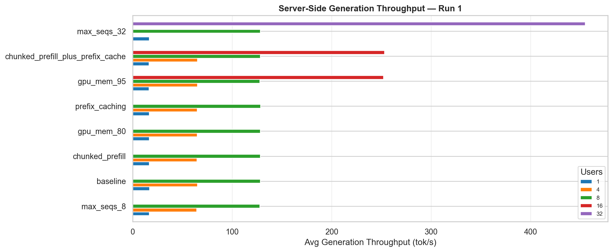

> **Throughput bar chart interpretation:** Throughput increases roughly linearly with concurrency. max_seqs_32 at u=32 reaches 455 tok/s — the GPU is utilized much more efficiently through batching.

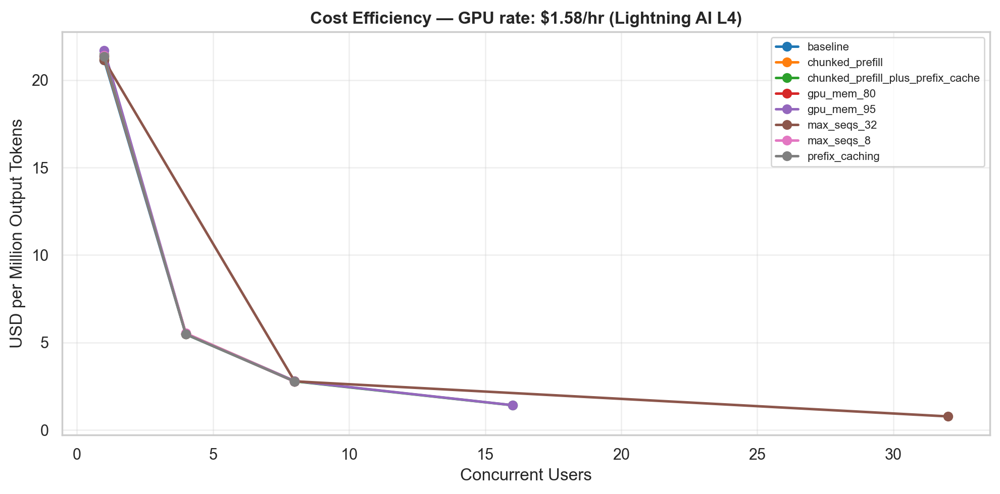

> **Cost chart interpretation:** At u=1 the cost is ~$21 per million output tokens. At u=32 it drops to ~$0.9. Higher concurrency means the same GPU does far more work, so per-token cost plummets.

---

## 8. Prefix Caching Deep Dive (Run 2)

In Run 2, all requests **share the same system prompt**. This maximizes prefix caching's chance to get cache hits.

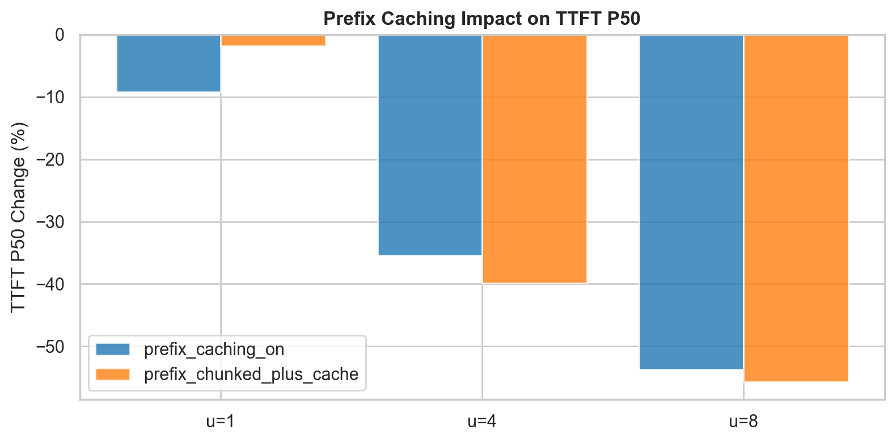

> **Prefix caching chart interpretation:** The TTFT improvement from prefix caching grows dramatically as concurrency increases.

### Results (% change vs baseline):

| Configuration | u=1 | u=4 | u=8 |
|---------------|-----|-----|-----|
| **prefix_caching_on** — TTFT P50 | -9.2% | -35.4% | **-53.7%** |
| **prefix_chunked_plus_cache** — TTFT P50 | -1.8% | -39.8% | **-55.7%** |

**Why does this happen?**
- At u=1 the cache is still cold (cold start), so the improvement is small
- At u=4 multiple requests share the same prefix → cache hit rate goes up
- At u=8 nearly every request reads from cache → TTFT drops by more than half

This shows that prefix caching is very effective in **chatbot** or **API gateway** scenarios where the same system prompt is reused across requests.

---

## 9. GPU Metrics

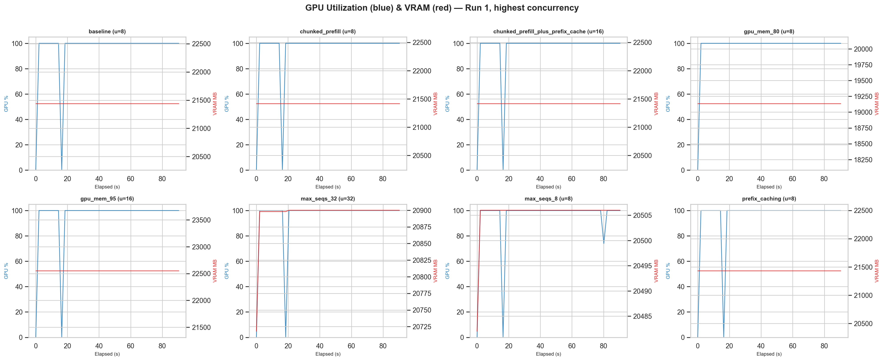

> **GPU Utilization chart:** Once the load starts, GPU jumps to 100% and stays there until the test ends. VRAM usage remains steady at ~20–23 GB depending on the configuration.

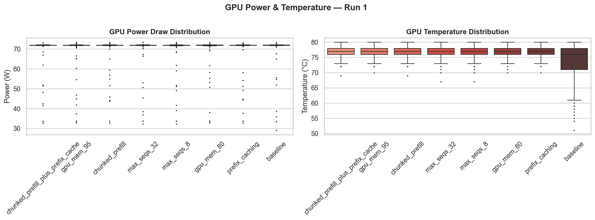

> **Power/Temp chart:** All configurations show similar power draw (~72 W) and temperature (75–77°C). Well below the GPU's 100°C thermal limit. Configuration changes don't affect the GPU's physical behavior.

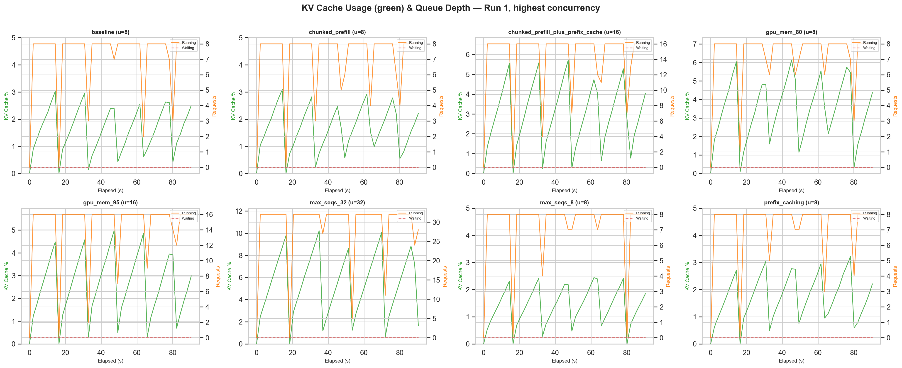

> **KV Cache time series:** The sawtooth pattern shows the cache filling up with incoming requests and draining as batches complete. At max_seqs_32 u=32, the waiting queue holds 15–25 requests — much deeper than other configurations.

---

## 10. Throughput vs Latency Tradeoff

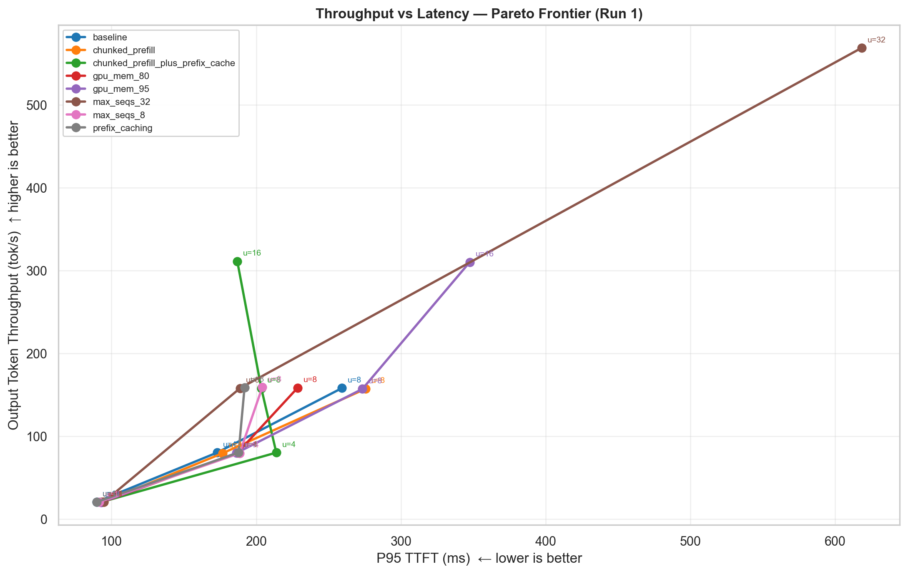

> **Pareto chart interpretation:** Bottom left = low throughput but low latency (u=1). Top right = high throughput but high latency (u=32). The `chunked_prefill_plus_prefix_cache` at u=16 is one of the closest points to the Pareto frontier — good throughput (253 tok/s) with reasonable latency (192 ms P99 TTFT).

---

## 11. Correlation Analysis

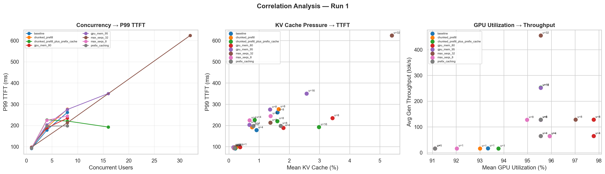

> **Left:** Concurrency ↔ P99 TTFT — Linear relationship. More users = higher TTFT.  
> **Center:** KV Cache ↔ TTFT — TTFT increases with KV cache usage, but in our scenario cache usage is so low (0–6%) that we don't see a major effect.  
> **Right:** GPU Utilization ↔ Throughput — GPU runs in the 91–98% band; throughput varies by user count and configuration.

---

## 12. Latency Scaling

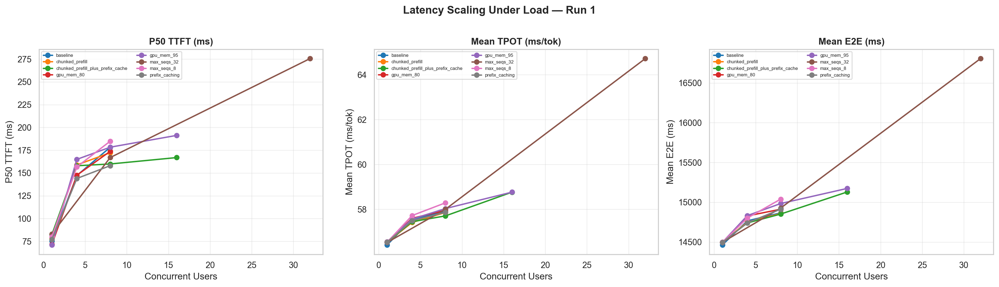

> **Latency Scaling interpretation:** In the left panel (TTFT), all configs rise at a similar slope — except max_seqs_32 at u=32, which spikes sharply. In the middle panel (TPOT), lines are nearly flat — decode speed is independent of concurrency. In the right panel (E2E), because TPOT is so stable, E2E is mostly dominated by TPOT.

---

## 13. Key Takeaways

### TPOT is independent of configuration
Token generation speed (56–59 ms/tok) stayed nearly identical across all experiments. This means the decode phase is bound by GPU **memory bandwidth** and is not affected by scheduling parameters.

### TTFT is sensitive to user count
Time to first token increases directly with concurrency. The reason: incoming requests must wait for ongoing decode batches to yield a scheduling slot.

### Prefix caching is very effective with shared prefixes
With requests sharing the same system prompt, TTFT improved by **up to 55%**. This is a major win for production chatbot applications.

### KV cache is not a bottleneck in this scenario
A 7B model on a 24 GB L4 uses only ~5% of the KV cache pool. With larger models or longer contexts, the picture would change significantly.

### Batching = throughput, but at a latency cost
With max_seqs_32 at u=32 we achieved 455 tok/s throughput, but per-user latency went up. In production, this tradeoff needs to be tuned based on SLA requirements.

### vLLM's default is well chosen
The `chunked_prefill + prefix_caching` combo (vLLM v0.16 default) provides the best throughput/latency balance at u=16. The vLLM developers made a good call setting this as the default.

---

## 14. Limitations

- Tests were run on a **single GPU** (L4) with a **single model** (7B). Results may differ on other GPUs and model sizes.
- Prompts are relatively **short** (max 127 tokens). With longer contexts, the effects of chunked prefill and KV cache parameters would be more pronounced.
- Each concurrency level ran for only **90 seconds**. Longer tests would better capture steady-state behavior.
- Requests are **independent** — in the real world, multi-turn conversations create different KV cache usage patterns.
