# Performance Evaluation of LLM Inference Frameworks

## Benchmarking Report — Qwen3-8B on GKE

---

## 1. Experimental Setup

| Parameter           | Value                                        |
| ------------------- | -------------------------------------------- |
| **Inference Engine**    | vLLM (V1 engine)                            |
| **GPU**                 | NVIDIA L4 — 24 GB VRAM (GKE)               |
| **GPU Hourly Cost**     | $1.58 / hr                                  |
| **Model**               | Qwen/Qwen3-8B                              |
| **Load Generator**      | Locust (streaming SSE)                      |
| **Concurrency Levels**  | 16, 32, 64 (Run 1) · 16, 32, 64, 128 (Run 2) |
| **Test Duration**       | 90 seconds per sub-test                     |
| **Quality Evaluation**  | lm-evaluation-harness (ARC-Challenge, MMLU, GSM8K) |

**Total requests processed: 2,274 — 99.7% success rate (7 failed).**

Two benchmark campaigns were conducted:

1. **Reasoning vs Non-Reasoning (Run 1 — `run_20260404_181323`):** Compares `VLLM_ENABLE_THINKING=true` vs `false` at u16, u32, u64
2. **KV Cache Dtype (Run 2 — `run_20260405_005704`):** Compares default (auto) vs FP8 KV cache dtype at u16, u32, u64, u128

---

## 2. Reasoning vs Non-Reasoning (Run 1)

### 2.1 Latency Summary

| Metric     | Reasoning (u16) | Non-Reasoning (u16) | Change       |
| ---------- | --------------- | -------------------- | ------------ |
| TTFT p50   | 460 ms          | 421 ms               | **−8%**      |
| TPOT p50   | 62.1 ms/tok     | 60.2 ms/tok          | **−3%**      |
| E2E p50    | 92,313 ms       | 49,705 ms            | **−46%**     |

| Metric     | Reasoning (u32) | Non-Reasoning (u32) | Change       |
| ---------- | --------------- | -------------------- | ------------ |
| TTFT p50   | 535 ms          | 422 ms               | **−21%**     |
| TPOT p50   | 81.5 ms/tok     | 76.1 ms/tok          | **−7%**      |
| E2E p50    | 127,119 ms      | 58,777 ms            | **−54%**     |

| Metric     | Reasoning (u64) | Non-Reasoning (u64) | Change       |
| ---------- | --------------- | -------------------- | ------------ |
| TTFT p50   | 549 ms          | 22,810 ms            | **+4,055%**  |
| TPOT p50   | 91.3 ms/tok     | 102.1 ms/tok         | **+12%**     |
| E2E p50    | 166,331 ms      | 94,475 ms            | **−43%**     |

Non-reasoning mode produces significantly lower E2E latency at all concurrency levels (46–54% faster) because it doesn't generate chain-of-thought tokens. TTFT and TPOT are comparable at lower concurrency. At u64, non-reasoning TTFT degrades heavily due to queue buildup — more requests compete for limited KV cache.

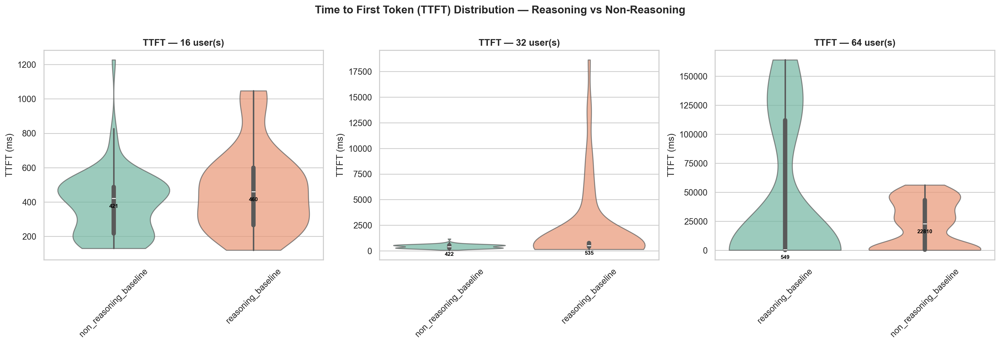

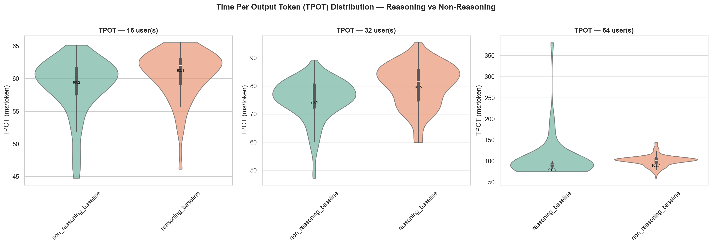

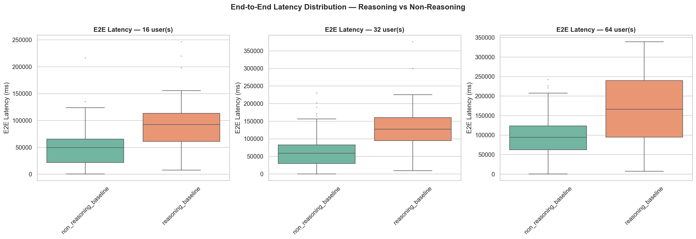

### 2.2 Throughput & Cost

| Config               | u16 tok/s | u32 tok/s | u64 tok/s | u16 $/M tok | u32 $/M tok | u64 $/M tok |
| -------------------- | --------- | --------- | --------- | ----------- | ----------- | ----------- |
| Reasoning            | 304       | 453       | 320       | $1.44       | $0.97       | $1.37       |
| Non-Reasoning        | 298       | 445       | 575       | $1.47       | $0.99       | $0.76       |

Non-reasoning scales better at u64 — throughput increases to 575 tok/s while reasoning drops to 320 tok/s. This is due to reasoning's longer sequences occupying more KV cache and causing preemptions.

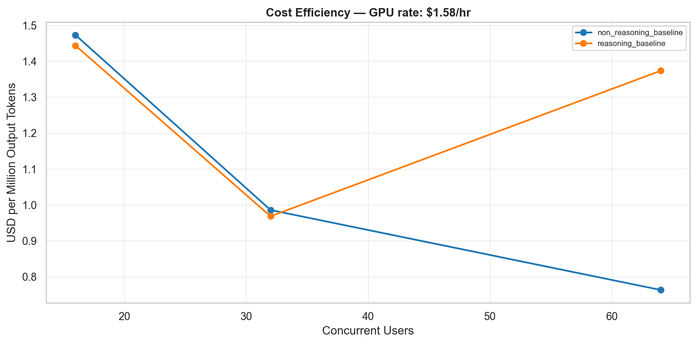

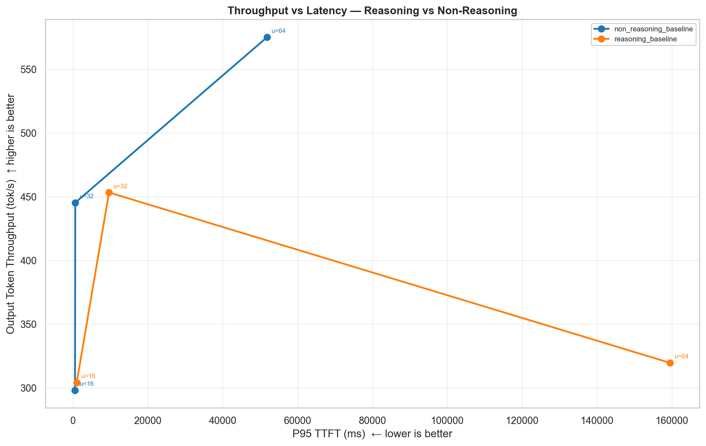

### 2.3 Server-Side Metrics

| Config                  | GPU Util | VRAM    | KV Cache | Gen TPS | Queue Wait |
| ----------------------- | -------- | ------- | -------- | ------- | ---------- |
| Reasoning @ u16         | 96.4%    | 20,756 MiB | 34.5% | 177     | 0.0        |
| Reasoning @ u32         | 93.1%    | 20,756 MiB | 69.1% | 269     | 0.4        |
| Reasoning @ u64         | 93.1%    | 20,756 MiB | 89.8% | 343     | 18.1       |
| Non-Reasoning @ u16     | 96.4%    | 20,756 MiB | 27.9% | 162     | 0.0        |
| Non-Reasoning @ u32     | 91.7%    | 20,756 MiB | 52.2% | 293     | 0.0        |
| Non-Reasoning @ u64     | 93.1%    | 20,756 MiB | 73.3% | 333     | 9.8        |

At u64, reasoning builds up 18 waiting requests vs 10 for non-reasoning. KV cache usage is slightly higher for reasoning due to longer sequences.

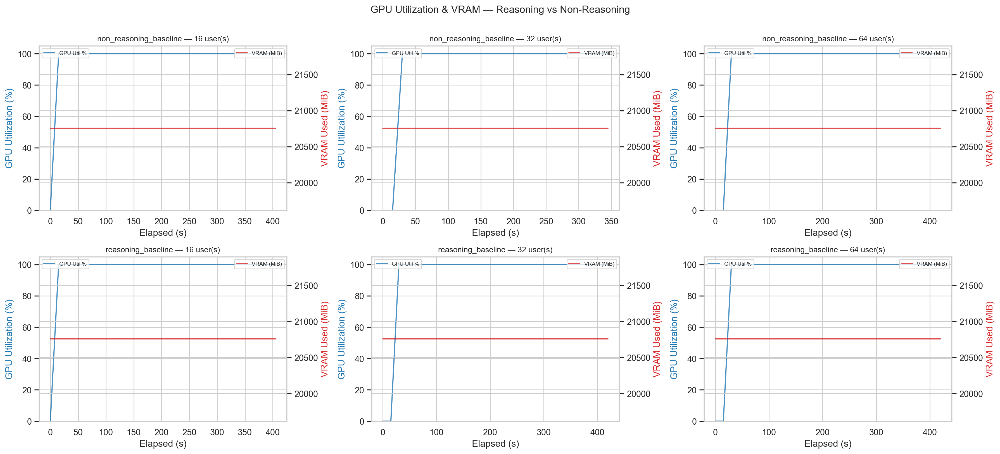

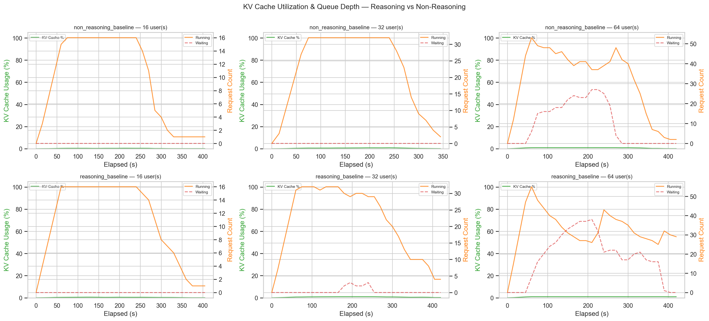

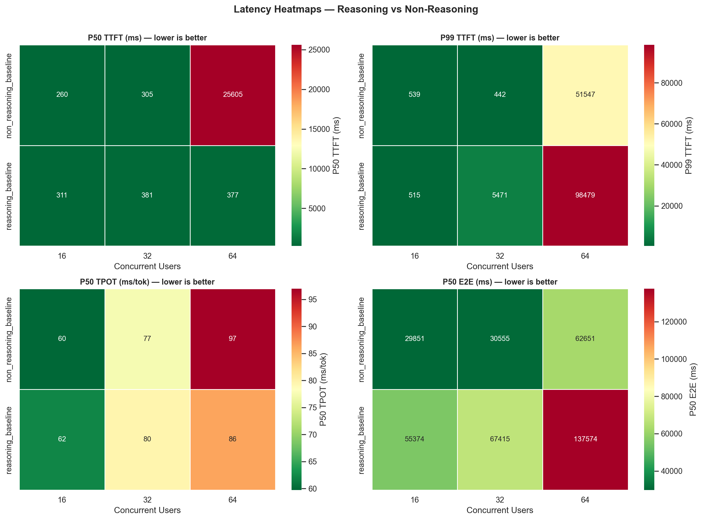

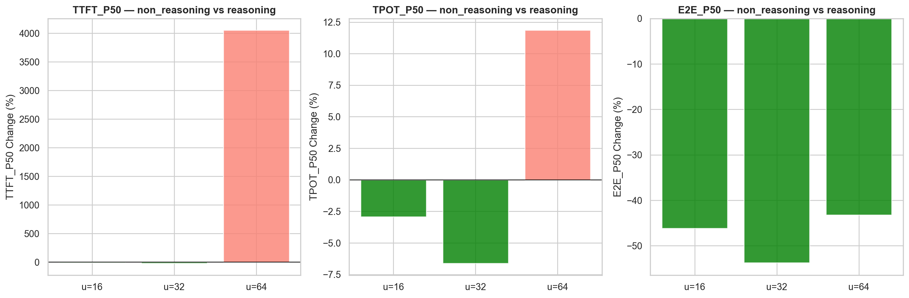

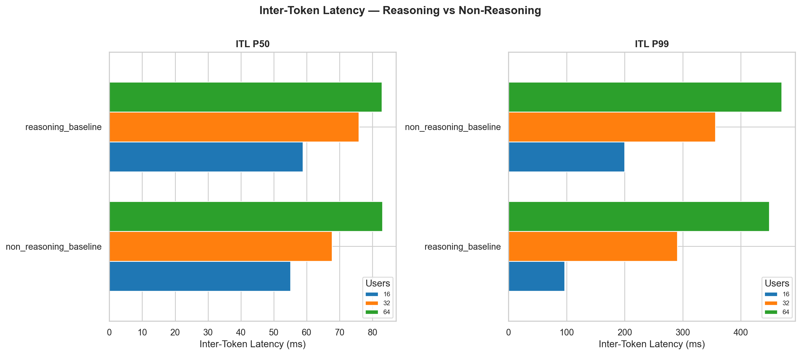

---

## 3. KV Cache Dtype — Auto vs FP8 (Run 2)

### 3.1 Latency Comparison

| Metric     | Auto (u16) | FP8 (u16) | Change     |
| ---------- | ---------- | --------- | ---------- |
| TTFT p50   | 358 ms     | 376 ms    | +5%        |
| TPOT p50   | 57.9 ms    | 52.4 ms   | **−10%**   |
| E2E p50    | 37,854 ms  | 41,413 ms | +9%        |

| Metric     | Auto (u32) | FP8 (u32) | Change     |
| ---------- | ---------- | --------- | ---------- |
| TTFT p50   | 441 ms     | 366 ms    | **−17%**   |
| TPOT p50   | 80.0 ms    | 65.7 ms   | **−18%**   |
| E2E p50    | 63,545 ms  | 46,510 ms | **−27%**   |

| Metric     | Auto (u64) | FP8 (u64) | Change     |
| ---------- | ---------- | --------- | ---------- |
| TTFT p50   | 30,433 ms  | 405 ms    | **−99%**   |
| TPOT p50   | 100.7 ms   | 93.6 ms   | **−7%**    |
| E2E p50    | 105,185 ms | 69,591 ms | **−34%**   |

| Metric     | Auto (u128)  | FP8 (u128)  | Change     |
| ---------- | ------------ | ----------- | ---------- |
| TTFT p50   | 143,695 ms   | 36,216 ms   | **−75%**   |
| TPOT p50   | 102.1 ms     | 124.7 ms    | +22%       |
| E2E p50    | 188,400 ms   | 124,353 ms  | **−34%**   |

The biggest impact of FP8 KV cache appears at high concurrency. At u64, TTFT drops from **30 seconds to 405 ms** — a dramatic improvement. Since FP8 KV cache uses less memory per token, it can serve more requests concurrently without queuing, significantly reducing wait times.

At u16, the difference is minimal because no queuing occurs.

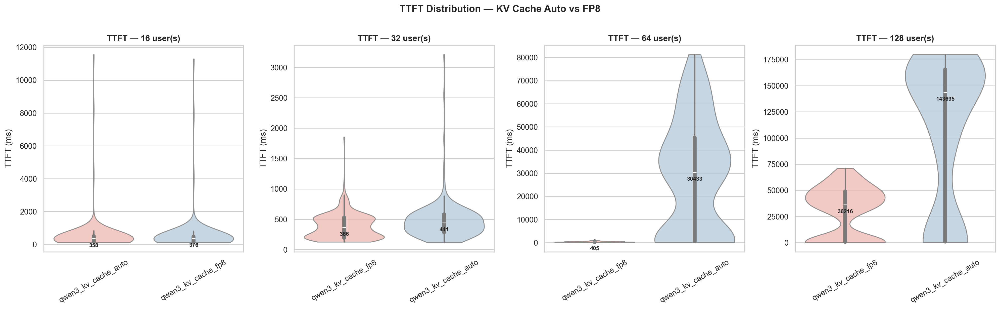

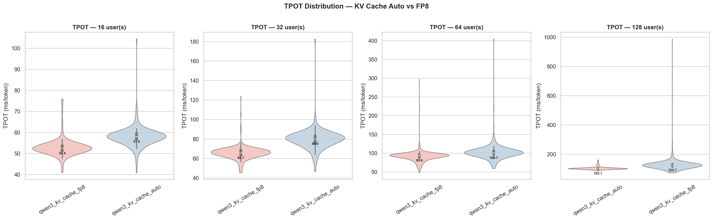

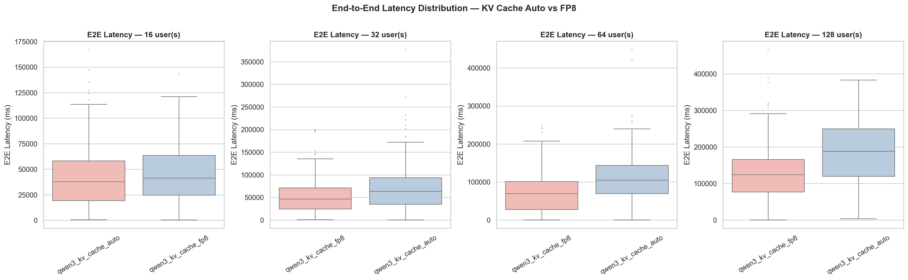

### 3.2 Throughput & Cost

| Config         | u16 tok/s | u32 tok/s | u64 tok/s | u128 tok/s | u16 $/M | u32 $/M | u64 $/M | u128 $/M |
| -------------- | --------- | --------- | --------- | ---------- | ------- | ------- | ------- | -------- |
| KV Cache Auto  | 275       | 411       | 527       | 313        | $1.60   | $1.07   | $0.83   | $1.40    |
| KV Cache FP8   | 285       | 493       | 735       | 901        | $1.54   | $0.89   | $0.60   | $0.49   |

With FP8 KV cache, throughput reaches **901 tok/s** at u128 — roughly **3× higher** than auto's 313 tok/s at the same level. Auto configuration sees throughput decline after u64, while FP8 continues scaling linearly up to u128.

In terms of cost, FP8 @ u128 achieves the lowest cost at **$0.49/M tokens**.

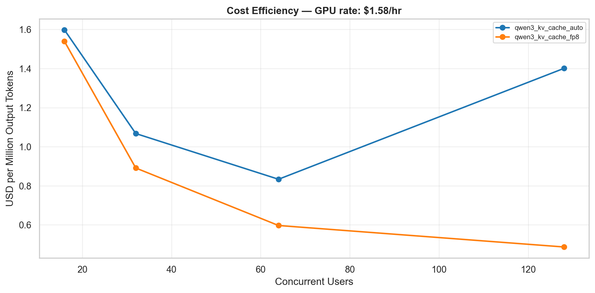

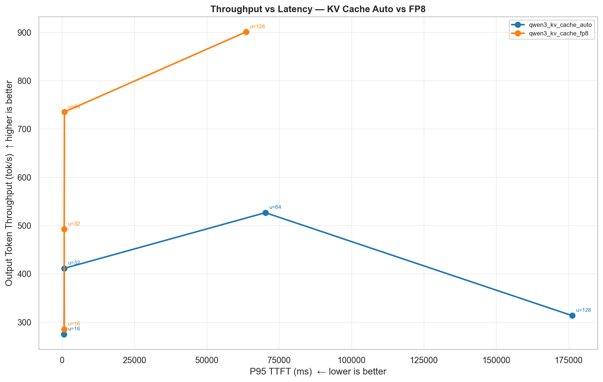

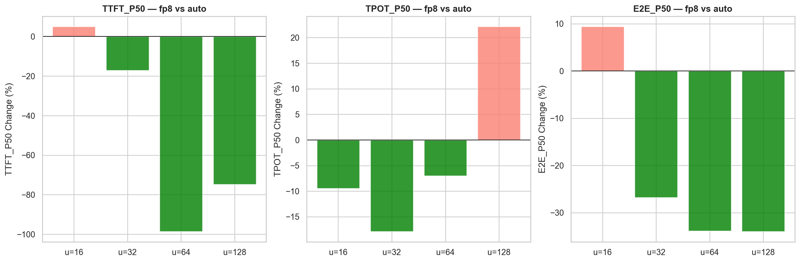

### 3.3 Server-Side Metrics

| Config              | GPU Util | VRAM       | KV Cache | Gen TPS | Queue Wait |
| ------------------- | -------- | ---------- | -------- | ------- | ---------- |
| Auto @ u16          | 96.6%    | 20,721 MiB | 26.7%    | 223     | 0.0        |
| Auto @ u32          | 94.6%    | 20,756 MiB | 57.6%    | 283     | 0.0        |
| Auto @ u64          | 94.6%    | 20,756 MiB | 79.4%    | 348     | 12.4       |
| Auto @ u128         | 94.6%    | 20,756 MiB | 92.4%    | 384     | 61.2       |
| FP8 @ u16           | 98.1%    | 21,463 MiB | 15.8%    | 214     | 0.0        |
| FP8 @ u32           | 94.6%    | 21,512 MiB | 29.8%    | 341     | 0.0        |
| FP8 @ u64           | 94.6%    | 21,512 MiB | 52.4%    | 493     | 0.0        |
| FP8 @ u128          | 94.6%    | 21,512 MiB | 81.6%    | 610     | 22.5       |

Critical difference: Auto @ u128 has **61 waiting requests** while FP8 @ u128 has only **23**. FP8 @ u64 has zero waiting requests, whereas auto averages 12.4.

FP8 KV cache uses less memory per token within the same VRAM budget, allowing more concurrent requests to be processed without queuing.

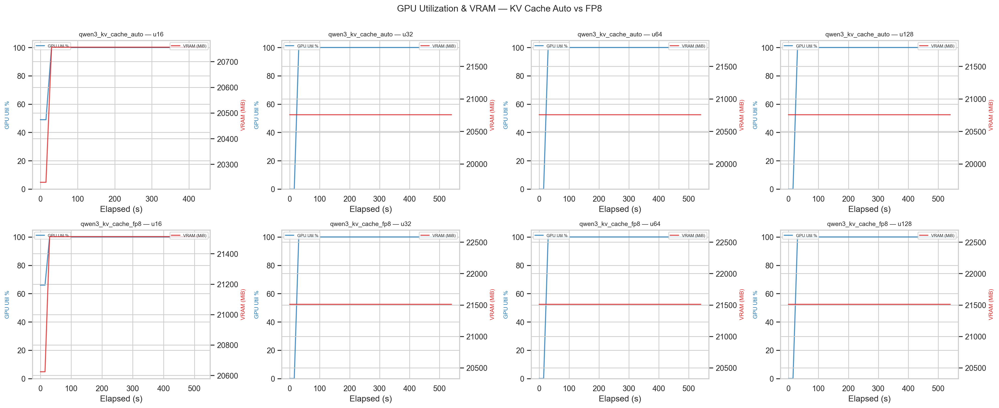

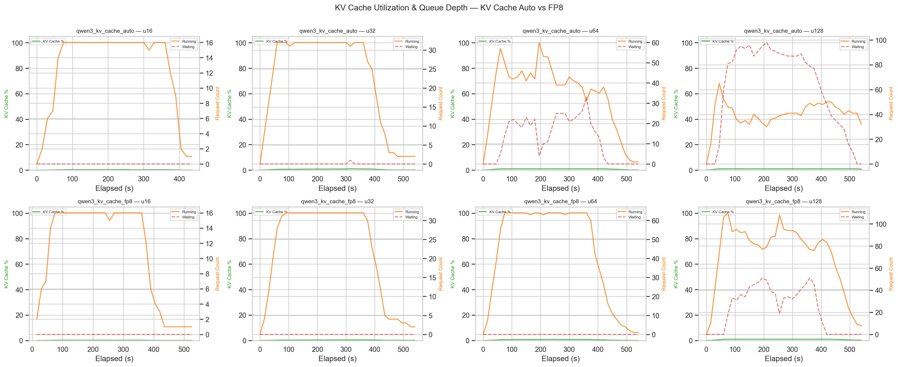

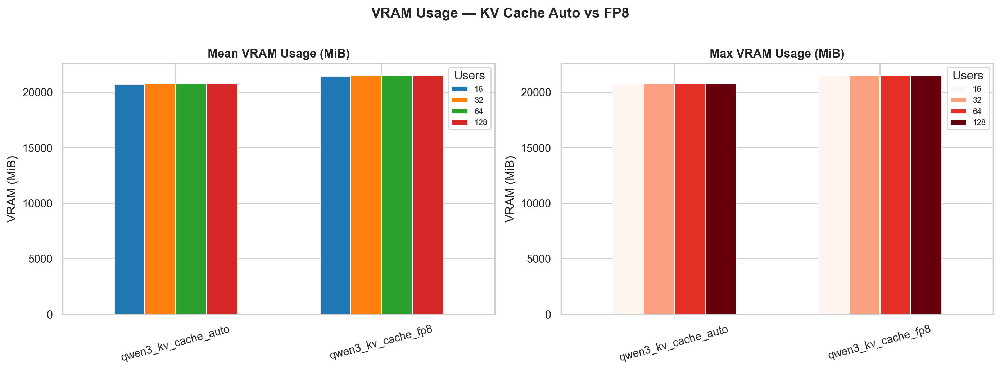

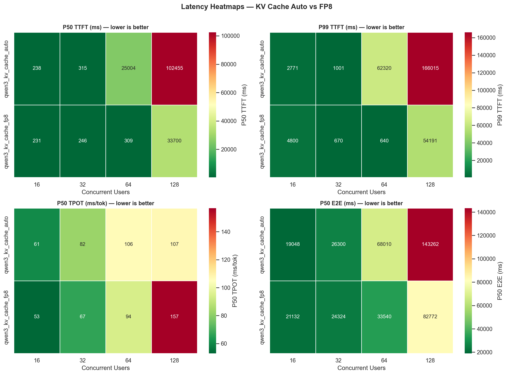

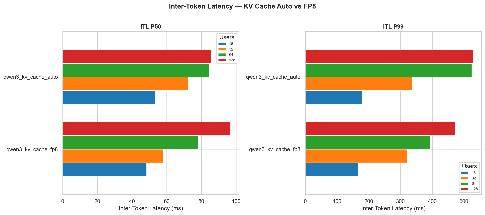

---

## 4. Quality Evaluation (Accuracy)

Quality evaluation was performed using `lm-evaluation-harness` across 3 different configurations.

### 4.1 Absolute Scores

| Config                    | ARC-Challenge | MMLU   | GSM8K  |
| ------------------------- | ------------- | ------ | ------ |
| Qwen3-8B (reasoning)     | 0.656         | 0.786  | 0.899  |
| Qwen3-8B (non-reasoning) | 0.656         | 0.786  | 0.896  |
| Qwen3-8B FP8+FP8 KV      | 0.660         | 0.797  | 0.879  |

### 4.2 Reasoning vs Non-Reasoning Quality Difference

| Benchmark     | Reasoning | Non-Reasoning | Difference |
| ------------- | --------- | ------------- | ---------- |
| ARC-Challenge | 0.656     | 0.656         | 0.0%       |
| MMLU          | 0.786     | 0.786         | 0.0%       |
| GSM8K         | 0.899     | 0.896         | −0.3%      |

The quality difference between reasoning and non-reasoning modes is negligible. Whether or not thinking tokens are generated does not impact final answer quality on these benchmarks.

### 4.3 FP8 Quantization Quality Impact

| Benchmark     | Baseline | FP8+FP8 KV | Change  |
| ------------- | -------- | ----------- | ------- |
| ARC-Challenge | 0.656    | 0.660       | +0.6%   |
| MMLU          | 0.786    | 0.797       | +1.4%   |
| GSM8K         | 0.899    | 0.879       | −2.2%   |

FP8 quantization shows minimal quality loss. GSM8K has −2.2% but ARC and MMLU even show slight gains. Overall within acceptable bounds.

---

## 5. Key Findings

1. **Non-reasoning mode reduces E2E latency by 46–54%** — not generating chain-of-thought tokens directly shortens response time. No quality loss observed.

2. **FP8 KV cache makes a major difference at high concurrency.** At u64, TTFT drops from 30 s to 400 ms. At u128, throughput increases 3× (313 → 901 tok/s).

3. **FP8 KV cache is neutral at low concurrency.** At u16, there is no meaningful difference between the two configurations.

4. **Cost-optimal configuration: FP8 KV cache @ u128** — lowest cost at $0.49/M tokens.

5. **Quality loss is negligible.** FP8 quantization is limited to max −2.2% (GSM8K), with slight gains on other benchmarks.

6. **Auto KV cache does not scale past u64** — throughput peaks at u64 and drops at u128. FP8 continues to scale linearly up to u128.

7. **GPU utilization exceeds 90% across all configurations** — the L4 is fully saturated.

### Recommendations

| Goal                    | Recommendation                                      |
| ----------------------- | --------------------------------------------------- |
| Best latency            | Non-reasoning + FP8 KV cache @ u64                  |
| Best throughput         | FP8 KV cache @ u128 (901 tok/s)                     |
| Best cost efficiency    | FP8 KV cache @ u128 ($0.49/M tokens)                |
| Best quality            | Baseline (FP16) — marginal gain over FP8            |
| Best latency/quality    | FP8 KV cache — Pareto-optimal                       |

---

*Report generated from benchmarking data collected on GKE infrastructure using vLLM, model Qwen/Qwen3-8B.*
*Grafana dashboards: [Run 1](https://snapshots.raintank.io/dashboard/snapshot/FMUfp7hDpPTDWjL8Its1VRDVYdL4tdTN) · [Run 2](https://snapshots.raintank.io/dashboard/snapshot/osvbKljgNvc34nwv8z92gkWelXPb0lnH)*
