# Performance Evaluation of LLM Inference Frameworks

## Benchmarking Report — TurboQuant KV-Cache vs FP8 Baseline (Qwen3-8B)

---

## 1. Experimental Setup

| Parameter              | Value                                                                                  |
| ---------------------- | -------------------------------------------------------------------------------------- |
| **Inference Engine**   | vLLM (V1 engine)                                                                       |
| **GPU**                | NVIDIA L4 — 24 GB VRAM (GKE)                                                          |
| **GPU Hourly Cost**    | $1.58 / hr                                                                             |
| **Model**              | `Qwen/Qwen3-8B` (FP8 model weights, reasoning mode enabled)                            |
| **Load Generator**     | Locust (streaming SSE)                                                                 |
| **Concurrency Levels** | 32, 64, 128 (3bit_nc and k3v4_nc at 64/128 only)                                       |
| **Test Duration**      | ~90 seconds per sub-test                                                               |
| **Quality Evaluation** | lm-evaluation-harness · ARC-Challenge (5-shot, 1000 samples) · GSM8K (5-shot, 1000 samples) |

**Total successful requests across all experiments: 1,093.**

Two benchmark runs were collected:

1. **Run 1 — `run_20260511_234500`:** `fp8_baseline`, `turboquant_k8v4`, `turboquant_4bit_nc` at u32, u64, u128
2. **Run 2 — `run_20260512_090311`:** `turboquant_3bit_nc` at u32, u64, u128 and `turboquant_k3v4_nc` at u64, u128

### KV-cache variants compared

| Experiment                    | `--kv-cache-dtype` value | Description                                                            |
| ----------------------------- | ------------------------ | ---------------------------------------------------------------------- |
| `qwen3_kv_fp8_baseline`       | `fp8`                    | 8-bit floating point — reference baseline                              |
| `qwen3_kv_turboquant_k8v4`    | `turboquant_k8v4`        | FP8 keys + 4-bit values, no norm correction (least aggressive)         |
| `qwen3_kv_turboquant_4bit_nc` | `turboquant_4bit_nc`     | 4-bit keys + 4-bit values + norm correction                            |
| `qwen3_kv_turboquant_k3v4_nc` | `turboquant_k3v4_nc`     | 3-bit keys + 4-bit values + norm correction                            |
| `qwen3_kv_turboquant_3bit_nc` | `turboquant_3bit_nc`     | 3-bit keys + 3-bit values + norm correction (most aggressive)          |

---

## 2. Latency Comparison

### 2.1 P50 latencies vs FP8 baseline

| Metric (u32)   | fp8 baseline | k8v4         | 4bit_nc      | 3bit_nc      |
| -------------- | ------------ | ------------ | ------------ | ------------ |
| **TTFT p50**   | 446 ms       | 542 ms (+22%)| 649 ms (+46%)| 660 ms (+48%)|
| **TPOT p50**   | 64.1 ms/tok  | 95.9 (+50%)  | 101.4 (+58%) | 112.1 (+75%) |
| **E2E p50**    | 101,658 ms   | 163,928 (+61%)| 160,624 (+58%)| 168,016 (+65%)|

| Metric (u64)   | fp8 baseline | k8v4         | 4bit_nc      | k3v4_nc      | 3bit_nc      |
| -------------- | ------------ | ------------ | ------------ | ------------ | ------------ |
| **TTFT p50**   | 499 ms       | 554 ms (+11%)| 611 ms (+22%)| 771 ms (+54%)| 666 ms (+33%)|
| **TPOT p50**   | 89.2 ms/tok  | 131.3 (+47%) | 150.1 (+68%) | 175.8 (+97%) | 174.3 (+95%) |
| **E2E p50**    | 137,107 ms   | 254,701 (+86%)| 255,297 (+86%)| 229,213 (+67%)| 235,148 (+72%)|

| Metric (u128)  | fp8 baseline | k8v4         | 4bit_nc      | k3v4_nc      | 3bit_nc      |
| -------------- | ------------ | ------------ | ------------ | ------------ | ------------ |
| **TTFT p50**   | 1,020 ms     | 930 ms (−9%) | 810 ms (−21%)| 738 ms (−28%)| 827 ms (−19%)|
| **TPOT p50**   | 107.3 ms/tok | 137.7 (+28%) | 170.1 (+59%) | 201.6 (+88%) | 220.4 (+106%)|
| **E2E p50**    | 244,929 ms   | 246,515 (+1%)| 304,974 (+25%)| 277,534 (+13%)| 310,313 (+27%)|

**Observation:** The FP8 baseline is the fastest configuration at u32 and u64 across every latency metric. Every TurboQuant variant pays a per-token decode tax (TPOT up by **+28–106%**), proportional to compression aggressiveness. At u128 the picture shifts on TTFT only — TurboQuant variants serve first tokens **9–28% faster** than the saturated baseline because the smaller KV footprint reduces queue pressure, but TPOT still degrades severely and E2E remains worse for all variants except `k8v4` (essentially tied with the baseline).

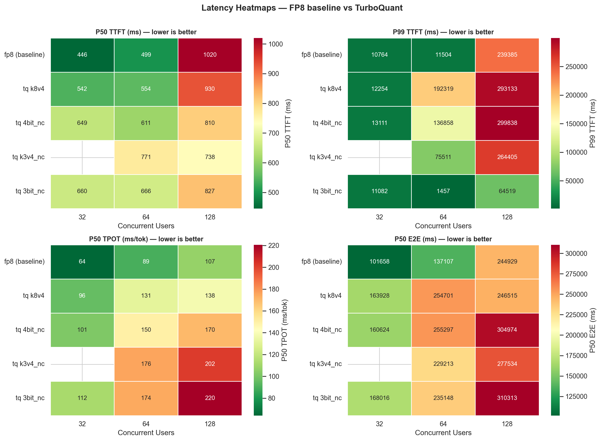

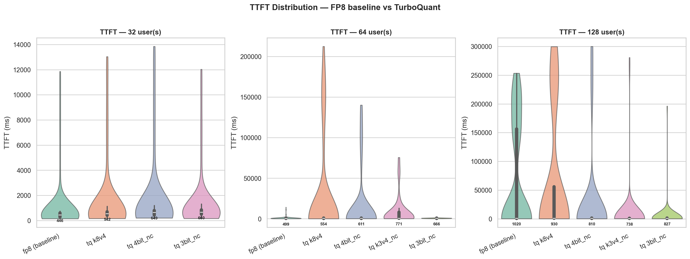

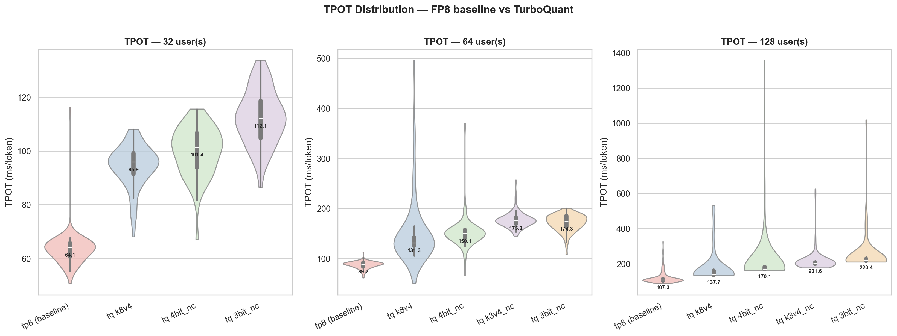

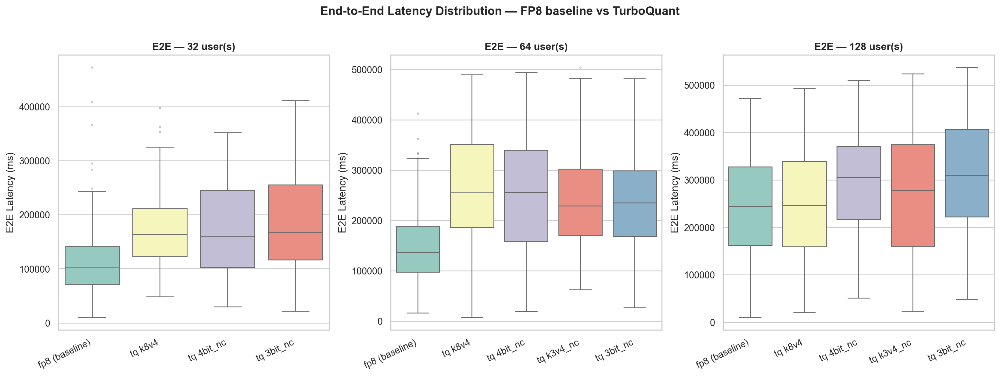

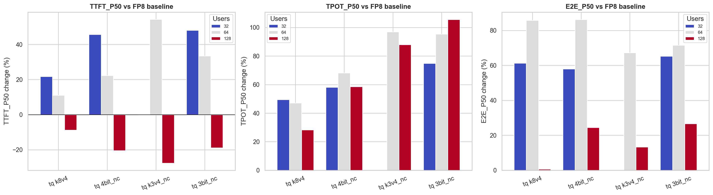

### 2.2 Inter-token latency

ITL P50 doubles or triples on the 3-bit variants — the dequantize-and-attend path on the value head is the bottleneck. The fp8 baseline holds ITL P50 ≈ 60–92 ms across all concurrency levels, while `3bit_nc` and `k3v4_nc` stretch out to 170–207 ms.

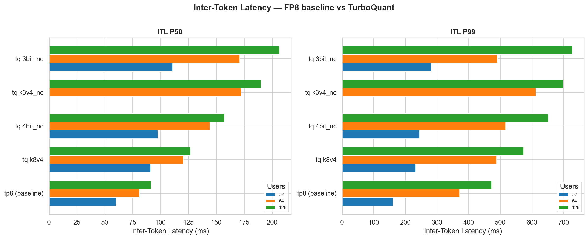

---

## 3. Throughput & Cost

| Config              | u32 tok/s | u64 tok/s | u128 tok/s | u32 $/M tok | u64 $/M tok | u128 $/M tok |
| ------------------- | --------- | --------- | ---------- | ----------- | ----------- | ------------ |
| **fp8 (baseline)**  | 624       | 869       | **1,097**  | $0.70       | $0.50       | **$0.40**    |
| **tq k8v4**         | 427       | 485       | 292        | $1.03       | $0.90       | $1.50        |
| **tq 4bit_nc**      | 382       | 525       | 575        | $1.15       | $0.84       | $0.76        |
| **tq k3v4_nc**      | —         | 387       | 760        | —           | $1.14       | $0.58        |
| **tq 3bit_nc**      | 388       | 491       | 392        | $1.13       | $0.89       | $1.12        |

**Observation:** The baseline scales linearly with concurrency (624 → 869 → 1,097 tok/s) and reaches the lowest cost at u128 (**$0.40/M tokens**). TurboQuant variants invert the expected memory-savings → throughput-gain relationship: throughput is **lower at every concurrency level**, and only `k3v4_nc` and `4bit_nc` even keep growing past u64. The cheapest TurboQuant cell (`k3v4_nc @ u128 = $0.58/M`) is still **45% more expensive** than the baseline at the same concurrency.

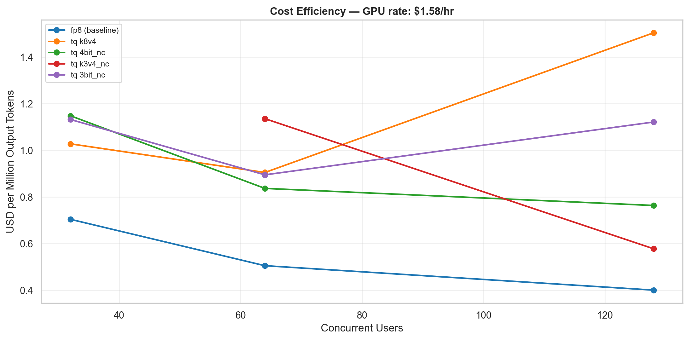

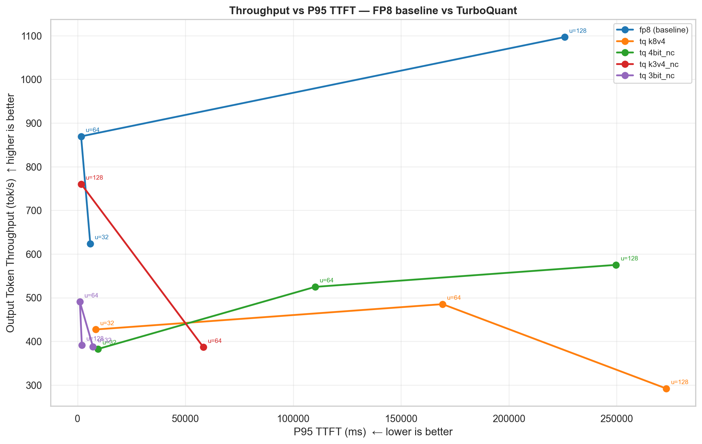

---

## 4. Server-Side Metrics

| Config            | GPU Util | VRAM       | KV Cache | Gen TPS | Queue Wait (mean / max) |
| ----------------- | -------- | ---------- | -------- | ------- | ----------------------- |
| fp8 @ u32         | 98.2%    | 20,632 MiB | 32.8%    | 288     | 0.0 / 0                 |
| fp8 @ u64         | 97.3%    | 20,648 MiB | 64.8%    | 435     | 0.3 / 5                 |
| fp8 @ u128        | 100.0%   | 20,648 MiB | 91.8%    | **540** | 38.5 / 73               |
| k8v4 @ u32        | 97.2%    | 20,225 MiB | 48.8%    | 204     | 0.0 / 0                 |
| k8v4 @ u64        | 97.3%    | 20,228 MiB | 87.3%    | 263     | 11.3 / 35               |
| k8v4 @ u128       | 91.1%    | 20,228 MiB | 91.4%    | 266     | 54.6 / 96               |
| 4bit_nc @ u32     | 97.2%    | 20,204 MiB | 37.5%    | 186     | 0.0 / 0                 |
| 4bit_nc @ u64     | 97.1%    | 20,204 MiB | 81.3%    | 271     | 4.8 / 24                |
| 4bit_nc @ u128    | 91.2%    | 20,204 MiB | 93.2%    | 301     | 39.4 / 80               |
| k3v4_nc @ u64     | 94.5%    | 20,224 MiB | 81.1%    | 254     | 2.2 / 11                |
| k3v4_nc @ u128    | 93.9%    | 20,224 MiB | 90.4%    | 288     | 35.4 / 72               |
| 3bit_nc @ u32     | 89.2%    | 20,206 MiB | 33.3%    | 179     | 0.0 / 0                 |
| 3bit_nc @ u64     | 94.2%    | 20,206 MiB | 65.3%    | 250     | 0.0 / 0                 |
| 3bit_nc @ u128    | 96.7%    | 20,254 MiB | 90.3%    | 271     | 31.7 / 70               |

**Observations:**

- **VRAM savings are tiny (~400 MiB out of 20.6 GiB).** TurboQuant only shrinks the KV-cache tensor; activations, model weights and vLLM allocators still dominate VRAM.
- **GPU utilization stays above 90%** for every cell. The L4 is fully saturated, so the compute cost of dequantization shows up directly in TPOT/ITL.
- **At u128, mean KV-cache usage is 90–93% across all variants** — TurboQuant does not free enough headroom to admit more concurrent requests; the queues grow just as fast.
- **Generation throughput on the vLLM side mirrors the client-side picture** — fp8 peaks at 540 tok/s, every TurboQuant variant stalls at ≈266–301 tok/s.

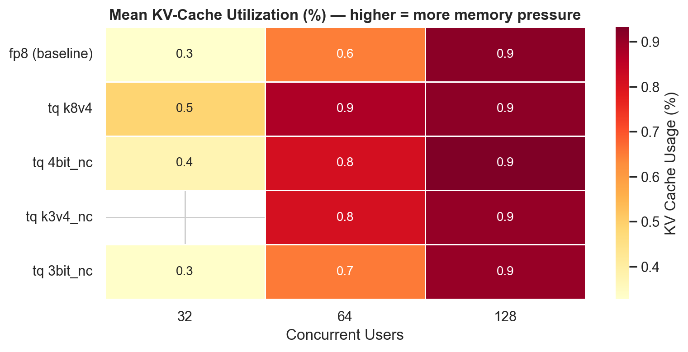

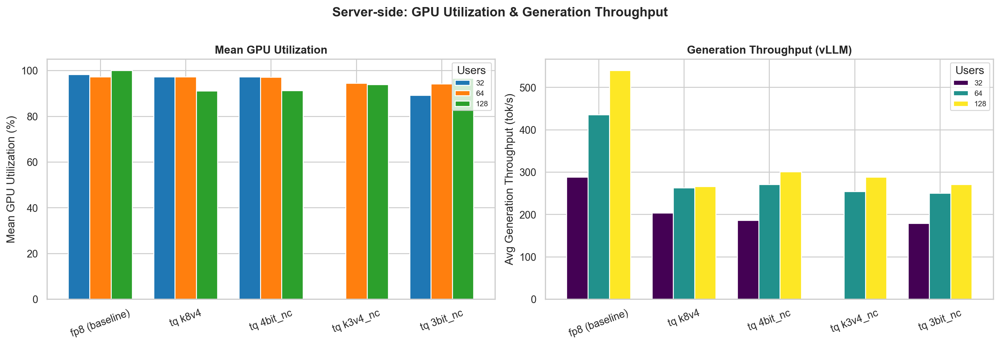

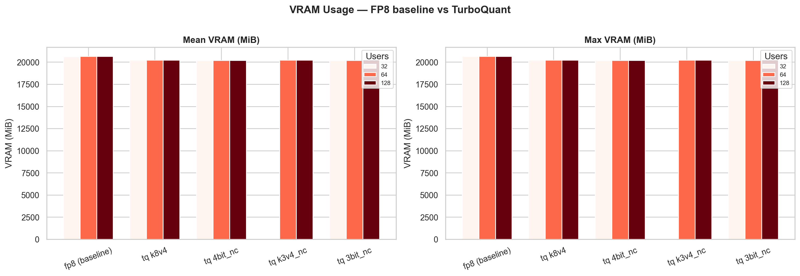

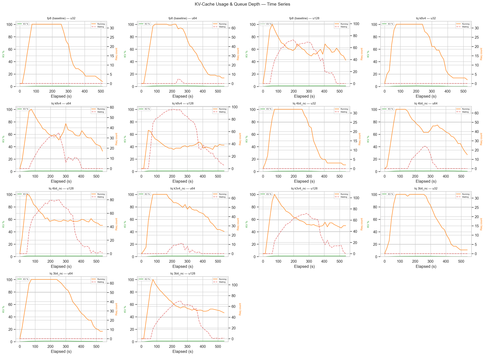

---

## 5. Quality Evaluation (Accuracy)

Quality measured with `lm-evaluation-harness` against each vLLM endpoint, 5-shot, 1000 samples per task, reasoning (`enable_thinking=true`) enabled.

### 5.1 Absolute scores

| Config                     | ARC-Challenge `acc` | ARC `acc_norm` | GSM8K `strict-match` | GSM8K `flexible-extract` |
| -------------------------- | ------------------- | -------------- | -------------------- | ------------------------- |
| **fp8 (baseline)**         | 0.653               | 0.660          | 0.879                | 0.879                     |
| **tq k8v4**                | 0.630               | 0.642          | **0.891**            | **0.890**                 |
| **tq 4bit_nc**             | 0.637               | 0.640          | 0.882                | 0.883                     |
| **tq k3v4_nc**             | 0.634               | 0.640          | 0.868                | 0.869                     |
| **tq 3bit_nc**             | 0.632               | 0.635          | 0.869                | 0.869                     |

### 5.2 Accuracy change vs FP8 baseline

| Config         | ARC `acc` Δ | ARC `acc_norm` Δ | GSM8K strict Δ | GSM8K flex Δ |
| -------------- | ----------- | ---------------- | -------------- | ------------ |
| tq k8v4        | −0.023      | −0.018           | **+0.012**     | **+0.011**   |
| tq 4bit_nc     | −0.016      | −0.020           | +0.003         | +0.004       |
| tq k3v4_nc     | −0.019      | −0.020           | −0.011         | −0.010       |
| tq 3bit_nc     | −0.021      | −0.025           | −0.010         | −0.010       |

**Observation:** Quality loss is **negligible** — every TurboQuant variant lands within ±2.5 percentage points of the FP8 baseline on both benchmarks. ARC-Challenge accuracy drops by ~2 pp uniformly; GSM8K actually *improves* by ~1 pp on the conservative `k8v4` and `4bit_nc` presets, and only loses ~1 pp on the 3-bit-value presets. Stderr on the harness runs is ±0.010–0.015, so most differences are inside statistical noise. **Aggressive KV compression does not meaningfully hurt task accuracy on these benchmarks.**

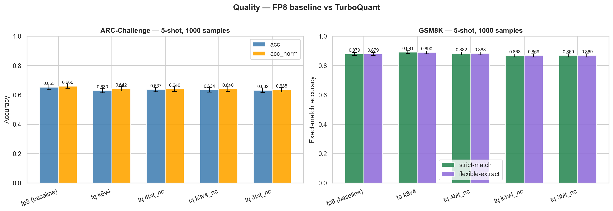

---

## 6. Quality–Performance Trade-off

The decisive view: every TurboQuant variant sits in a worse spot than the FP8 baseline on both axes — quality is at-or-below baseline, and headline throughput / TTFT are clearly worse. There is no Pareto-superior alternative to FP8 on this hardware.

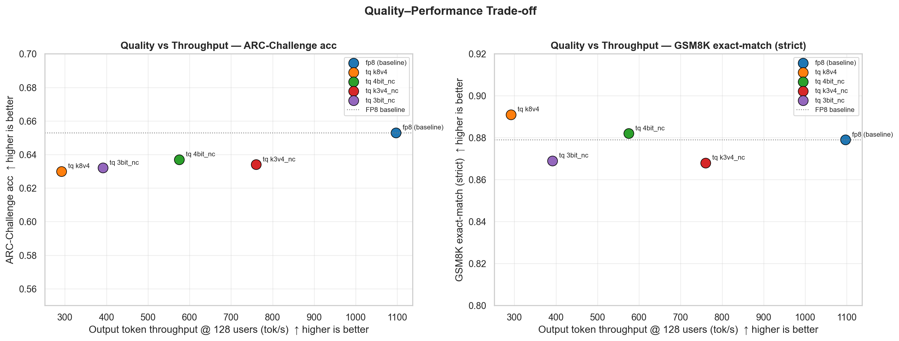

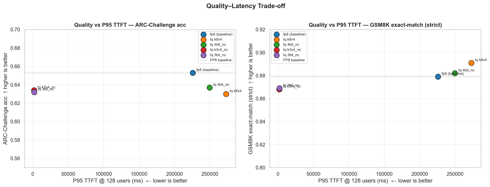

---

## 7. Key Findings

1. **FP8 baseline wins on every performance axis on the L4.** TPOT regresses by **+28% (k8v4) to +106% (3bit_nc)** at u128, ITL roughly doubles on the 3-bit variants, and throughput tops out at 575 tok/s for the best TurboQuant preset vs **1,097 tok/s for fp8**.

2. **TurboQuant gives a small TTFT win only at saturation.** At u128, smaller KV blocks let new requests admit faster — TTFT P50 drops by 9–28% — but this is fully canceled by slower per-token decode, so E2E latency remains equal or worse.

3. **VRAM savings are negligible (~400 MiB out of 20.6 GiB).** The KV cache is only a fraction of total VRAM use; compressing it doesn't expand effective concurrency. Mean KV-cache usage at u128 sits at 90–93% across all variants, including the baseline.

4. **Quality loss is within statistical noise.** ARC accuracy is down ~2 pp uniformly, GSM8K is essentially unchanged (or even slightly better on `k8v4` / `4bit_nc`). TurboQuant **does not meaningfully degrade task accuracy**, even at 3-bit keys + 3-bit values.

5. **Cost-optimal configuration remains FP8 KV @ u128 at $0.40/M tokens.** The cheapest TurboQuant cell (`k3v4_nc @ u128`) is $0.58/M — 45% more expensive — and every other TurboQuant cell is well above $0.75/M.

6. **GPU utilization is >90% everywhere** — the L4 is the bottleneck. The added compute from dequantization manifests directly as slower decoding rather than as memory headroom.

### Recommendations

| Goal                           | Recommendation                                                                            |
| ------------------------------ | ----------------------------------------------------------------------------------------- |
| **Best throughput / cost**     | **FP8 KV (baseline)** — 1,097 tok/s @ u128, $0.40/M tokens                                |
| **Best TPOT / ITL**            | **FP8 KV (baseline)** — clearly fastest per-token decode at every concurrency             |
| **Best TTFT under saturation** | `turboquant_k3v4_nc` (~28% faster than fp8 @ u128) — useful only when admit-time matters more than per-token speed |
| **Best quality**               | **FP8 KV (baseline)** — top on ARC; GSM8K essentially tied with `k8v4`                    |
| **Smallest KV memory**         | `turboquant_3bit_nc` — but the VRAM saving is too small to unlock additional concurrency on the L4 |

The takeaway: on the L4-class GPU with a model the size of Qwen3-8B, TurboQuant's compute overhead outweighs its memory savings. The technique would likely become attractive on larger models (where KV dominates VRAM) or on hardware with cheaper dequant paths — but on this configuration, **FP8 KV remains the best operating point**.

---

*Report generated from benchmarking data collected on GKE infrastructure using vLLM and `Qwen/Qwen3-8B`.*

*Grafana dashboards: [Run 1](https://snapshots.raintank.io/dashboard/snapshot/50Lems4r8TZGNzprmjXEGQHuT0rkvsPi) · [Run 2](https://snapshots.raintank.io/dashboard/snapshot/dJqN5aINpnl9TmdGr8yUvM4QY0DgpkYN)*
