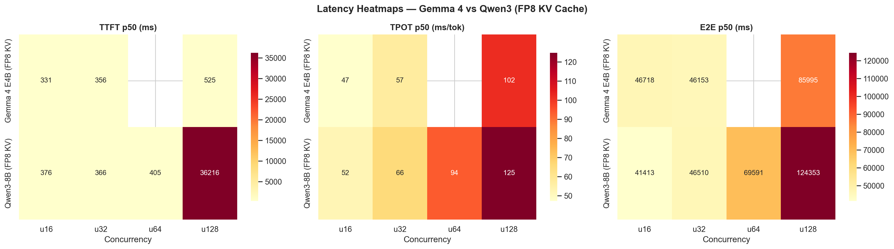
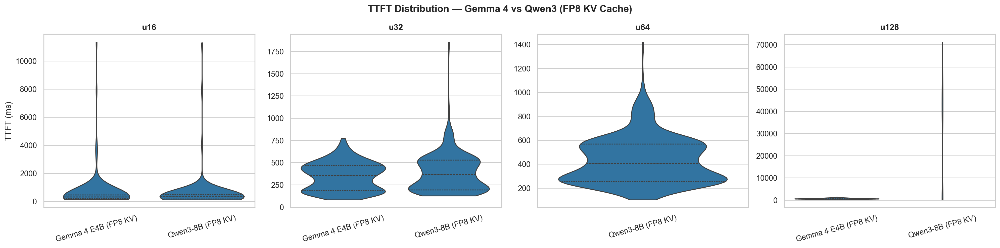
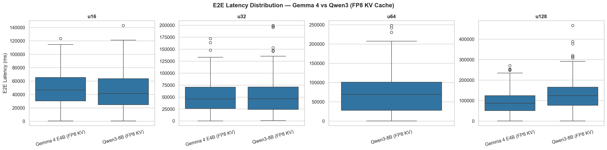
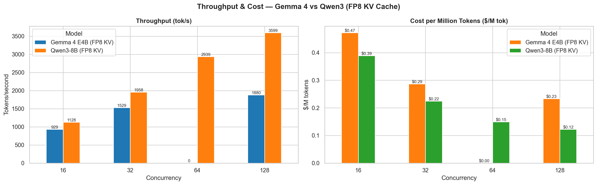
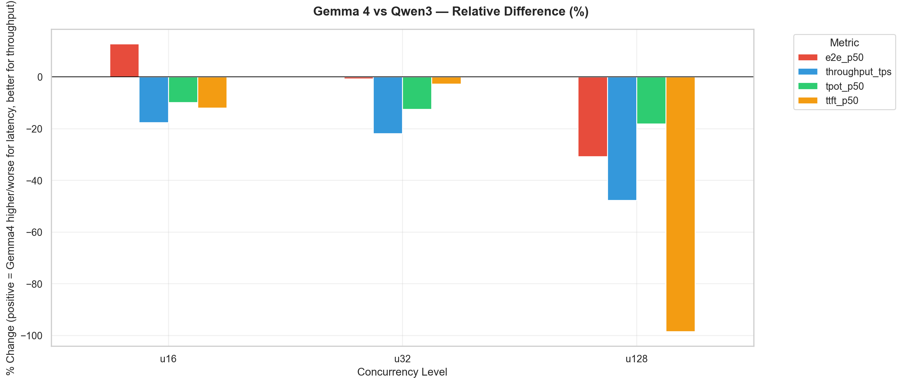
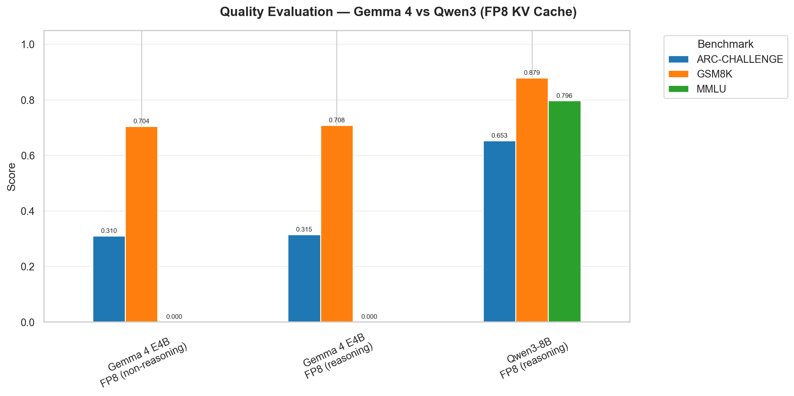

# Performance Evaluation of LLM Inference Frameworks

## Benchmarking Report — Gemma 4 E4B vs Qwen3-8B

---

## 1. Experimental Setup

| Parameter           | Value                                        |
| ------------------- | -------------------------------------------- |
| **Inference Engine**    | vLLM (V1 engine)                            |
| **GPU**                 | NVIDIA L4 — 24 GB VRAM (GKE)               |
| **GPU Hourly Cost**     | $1.58 / hr                                  |
| **Models**              | `google/gemma-4-E4B-it` vs `Qwen/Qwen3-8B` |
| **Configuration**       | FP8 KV Cache (both models)                  |
| **Load Generator**      | Locust (streaming SSE)                      |
| **Concurrency Levels**  | 16, 32, 64*, 128                            |
| **Test Duration**       | 90 seconds per sub-test                     |
| **Quality Evaluation**  | lm-evaluation-harness (ARC-Challenge, GSM8K, MMLU) |

*\*Note: Gemma 4 u64 benchmark failed to generate custom metrics during the run and was excluded from the charts.*

**Datasets compared:**
1. **Gemma 4 Baseline:** `run_20260416_010036/gemma4_kv_fp8_baseline`
2. **Qwen3 Baseline:** `run_20260405_005704/qwen3_kv_cache_fp8`

---

## 2. Latency Comparison

| Metric      | Gemma 4 E4B (u16) | Qwen3-8B (u16) | % Diff (Gemma vs Qwen) |
| ----------- | ----------------- | -------------- | ---------------------- |
| **TTFT p50**| 331 ms            | 376 ms         | **−12%**               |
| **TPOT p50**| 47.3 ms/tok       | 52.4 ms/tok    | **−10%**               |
| **E2E p50** | 46,718 ms         | 41,413 ms      | **+13%**               |

| Metric      | Gemma 4 E4B (u32) | Qwen3-8B (u32) | % Diff (Gemma vs Qwen) |
| ----------- | ----------------- | -------------- | ---------------------- |
| **TTFT p50**| 356 ms            | 366 ms         | **−3%**                |
| **TPOT p50**| 57.4 ms/tok       | 65.7 ms/tok    | **−13%**               |
| **E2E p50** | 46,153 ms         | 46,510 ms      | **−1%**                |

| Metric      | Gemma 4 E4B (u128)| Qwen3-8B (u128)| % Diff (Gemma vs Qwen) |
| ----------- | ----------------- | -------------- | ---------------------- |
| **TTFT p50**| 525 ms            | 36,216 ms      | **−98.5%**             |
| **TPOT p50**| 102.0 ms/tok      | 124.7 ms/tok   | **−18%**               |
| **E2E p50** | 85,995 ms         | 124,353 ms     | **−31%**               |

**Observation:** Gemma 4 demonstrates **extraordinary resilience** to high concurrency queueing. At u128, Qwen3's TTFT spikes to an unusable 36.2 seconds due to severe queue buildup, whereas Gemma 4 comfortably maintains a 525 ms TTFT. Gemma 4 also consistently provides a slightly better TPOT across all levels. 

---

## 3. Throughput & Cost

| Model / Concurrency | u16 (tok/s) | u32 (tok/s) | u128 (tok/s) | u16 ($/M tok) | u32 ($/M tok) | u128 ($/M tok) |
| ------------------- | ----------- | ----------- | ------------ | ------------- | ------------- | -------------- |
| **Gemma 4 E4B**     | 929         | 1,529       | 1,880        | $0.47         | $0.29         | $0.23          |
| **Qwen3-8B**        | 1,128       | 1,958       | 3,599        | $0.39         | $0.22         | $0.12          |

**Observation:** While Gemma 4 handles latency extremely well, **Qwen3 generates significantly more overall throughput**. At u128, Qwen3 achieves 3,599 tok/s compared to Gemma 4's 1,880 tok/s. This results in Qwen3 being nearly twice as cost-effective at high load ($0.12 vs $0.23 per million tokens).

---

## 4. Quality Evaluation (Accuracy)

Quality evaluation results from `lm-evaluation-harness` using the FP8 quantization.
*(Note: MMLU results for Gemma 4 were unavailable during this evaluation).*

| Model / Configuration          | ARC-Challenge | GSM8K  | MMLU   |
| ------------------------------ | ------------- | ------ | ------ |
| **Gemma 4 E4B** (non-reasoning)| 0.310         | 0.704  | N/A    |
| **Gemma 4 E4B** (reasoning)    | 0.315         | 0.708  | N/A    |
| **Qwen3-8B** (reasoning)       | 0.653         | 0.879  | 0.796  |

**Observation:** Qwen3-8B heavily outperforms Gemma 4 E4B across both ARC-Challenge (65% vs 31%) and GSM8K (88% vs 70%). Additionally, enabling reasoning for Gemma 4 yielded virtually identical scores to the non-reasoning mode.

---

## 5. Key Findings

1. **Gemma 4 is exceptionally stable under load:** The most dramatic difference between the two models is their queue behavior at high concurrency. At 128 concurrent users, Qwen3 essentially collapses (36.2s Time-To-First-Token), while Gemma 4 remains fast and usable (525ms).
2. **Qwen3 offers much higher peak throughput:** Despite its queueing issues, Qwen3 churns through tokens almost 2x faster than Gemma 4 at peak concurrency, reaching nearly 3,600 req/s, translating to $0.12/M tokens vs Gemma 4's $0.23/M tokens.
3. **Qwen3 has superior quality:** In standard benchmarks (ARC, GSM8K), Qwen3 significantly outscores Gemma 4. 
4. **Gemma 4 TPOT is more efficient:** Gemma 4 has slightly lower TPOT (Time Per Output Token) values compared to Qwen3 across all concurrency levels.

### Recommendations

| Priority                | Recommended Model Configuration            | Rationale                                                                 |
| ----------------------- | ------------------------------------------ | ------------------------------------------------------------------------- |
| **Best Responsiveness (TTFT)** | **Gemma 4 E4B (FP8 KV)**            | Remains incredibly responsive (sub-600ms) even under extreme 128 user load. |
| **Best Throughput & Cost**     | **Qwen3-8B (FP8 KV)**               | Reaches 3,599 tok/s, costing only $0.12 per million tokens.                 |
| **Best Quality**               | **Qwen3-8B (FP8 KV)**               | Significantly higher scores on ARC and GSM8K.                                |

---

*Report generated from benchmarking data collected on GKE infrastructure using vLLM using NVIDIA L4 instances.*
